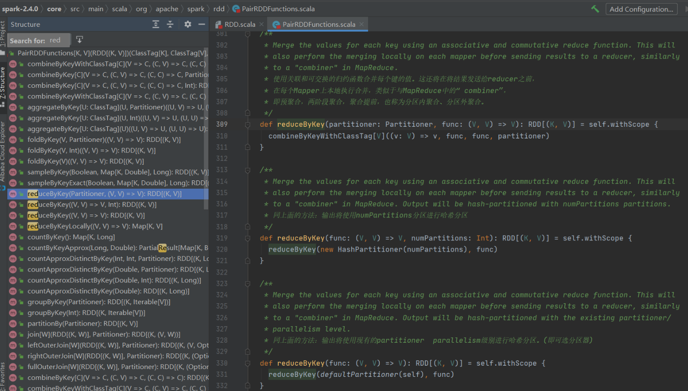
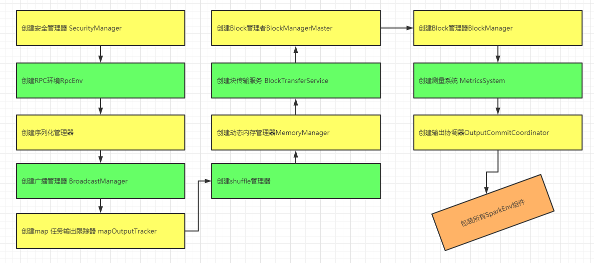
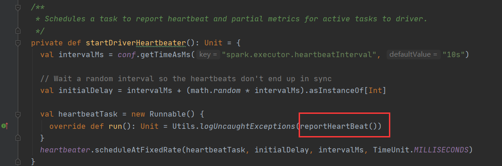
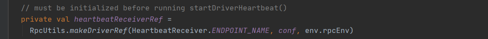
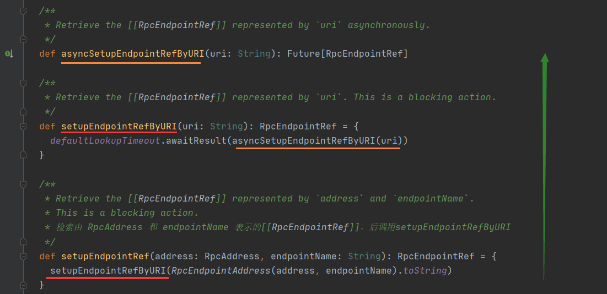
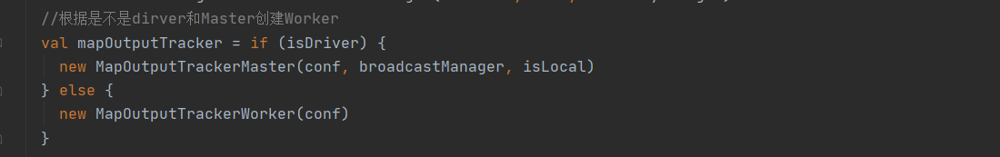
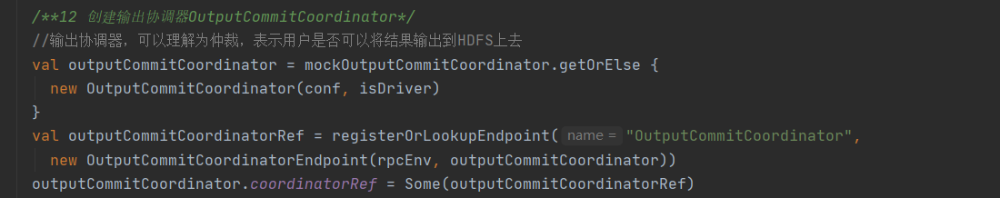
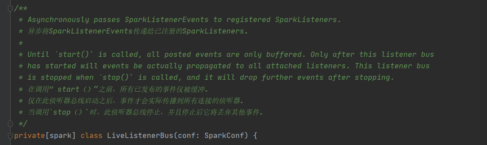
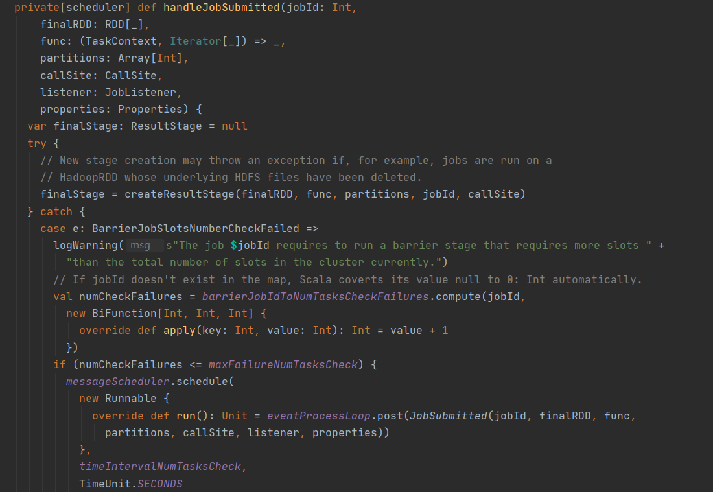
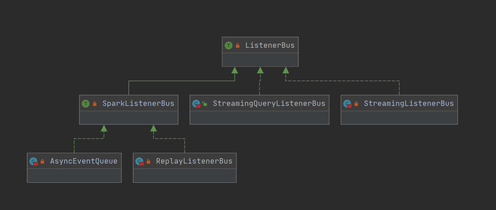

## 0 基础准备

[http://spark.apache.org/docs/2.4.0/](http://spark.apache.org/docs/2.4.0/)

### 0.1 通过下载源码的方式

> 这种方式一般用于深入解读框架流程，可以在其中加入我们自己的代码注释，方便忘记后回顾和深度剖析（一般情况下都是一个很长的过程，那么我们下一次就可以接着上次剖析的位置接着剖析）

[https://archive.apache.org/dist/spark/spark-2.4.0/spark-2.4.0.tgz](https://archive.apache.org/dist/spark/spark-2.4.0/spark-2.4.0.tgz)

1. 从上述下载地址下载spark-2.4.0.tgz包

2. 将taz包进行解压
3. 通过IDEA进行加载


### 0.2 通过导入maven的形式

> 此方法用于平时开发中需要看算子使用等情况时阅读，用如下xml即可关联IDEA去自动下载我们需要的包，然后直接阅读

- 参考pom.xml

```ruby
<dependencies>        
	<!-- scala -->
        <dependency>
            <groupId>org.scala-lang</groupId>
            <artifactId>scala-library</artifactId>
            <version>2.11.12</version>
        </dependency>
        <dependency>
            <groupId>org.scala-lang</groupId>
            <artifactId>scala-compiler</artifactId>
            <version>2.11.12</version>
        </dependency>
        <dependency>
            <groupId>org.scala-lang</groupId>
            <artifactId>scala-reflect</artifactId>
            <version>2.11.12</version>
        </dependency>
        <!-- Spark Core -->
        <dependency>
            <groupId>org.apache.spark</groupId>
            <artifactId>spark-core_2.11</artifactId>
            <version>2.4.0</version>
        </dependency>
        <!-- Spark SQL -->
        <dependency>
            <groupId>org.apache.spark</groupId>
            <artifactId>spark-sql_2.11</artifactId>
            <version>2.4.0</version>
        </dependency>
        <!-- Spark Streaming -->
        <dependency>
            <groupId>org.apache.spark</groupId>
            <artifactId>spark-streaming_2.11</artifactId>
            <version>2.4.0</version>
        </dependency>
        <!--mysql依赖的jar包-->
        <dependency>
            <groupId>mysql</groupId>
            <artifactId>mysql-connector-java</artifactId>
            <version>5.1.47</version>
        </dependency>

    </dependencies>

    <repositories>
        <repository>
            <id>cloudera</id>
            <url>https://repository.cloudera.com/artifactory/cloudera-repos/</url>
        </repository>
    </repositories>
    <build>
        <plugins>
            <!-- 在maven项目中既有java又有scala代码时配置 maven-scala-plugin 插件打包时可以将两类代码一起打包 -->
            <plugin>
                <groupId>org.scala-tools</groupId>
                <artifactId>maven-scala-plugin</artifactId>
                <version>2.15.2</version>
                <executions>
                    <execution>
                        <goals>
                            <goal>compile</goal>
                            <goal>testCompile</goal>
                        </goals>
                    </execution>
                </executions>
            </plugin>
            <plugin>
                <!-- MAVEN 编译使用的JDK版本 -->
                <groupId>org.apache.maven.plugins</groupId>
                <artifactId>maven-compiler-plugin</artifactId>
                <version>3.3</version>
                <configuration>
                    <source>1.8</source>
                    <target>1.8</target>
                    <encoding>UTF-8</encoding>
                </configuration>
            </plugin>
            <plugin>
                <groupId>org.apache.maven.plugins</groupId>
                <artifactId>maven-assembly-plugin</artifactId>
                <version>3.0.0</version>
                <executions>
                    <execution>
                        <phase>package</phase><!--绑定到package生命周期阶段-->
                        <goals>
                            <goal>single</goal><!--只运行一次-->
                        </goals>
                    </execution>
                </executions>
                <configuration>
                    <!--<finalName></finalName>&lt;!&ndash;主类入口&ndash;&gt;-->
                    <descriptorRefs>
                        <descriptorRef>jar-with-dependencies</descriptorRef>
                    </descriptorRefs>
                </configuration>
            </plugin>

            <plugin>
                <groupId>org.apache.maven.plugins</groupId>
                <artifactId>maven-surefire-plugin</artifactId>
                <version>2.10</version>
                <configuration>
                    <skip>true</skip>
                </configuration>
            </plugin>
        </plugins>
    </build>
```


## 1 通过WordCount案例来抛出问题

### 1.1 案例

- word.csv

```ruby
hello,spark
hello,scala,hadoop
hello,hdfs
hello,spark,hadoop
hello
```

- 代码实现

```scala
import org.apache.spark.{SparkConf, SparkContext}

object WordCount {
  def main(args: Array[String]): Unit = {
    val conf = new SparkConf().setAppName("WordCount").setMaster("local[*]")
    val sc = new SparkContext(conf)
    val tuples: Array[(String, Int)] = sc.textFile(ClassLoader.getSystemResource("word.csv").getPath)
      .flatMap(_.split(","))
      .map((_, 1))
      .reduceByKey(_ + _)
      .collect()
    tuples.foreach(println)
  }
}
```

- 结果

```ruby
(scala,1)
(hello,5)
(spark,2)
(hadoop,2)
(hdfs,1)
```

### 1.2 抛出问题

1. 上面的算子干了什么?
2. 什么时候执行的？

### 1.3 查看解释

- **RDD 和 PairRDD**对应的Transformation方法，发现都是返回了**RDD**




- 查看到spark源码中**RDD**中的**collect**方法(Action)，发现返回值不再是RDD，而是需要的结果集，而且调用了RunJob


>总结：
>
>Transformation（懒算子），返回值都为RDD，代表其还可以继续转换。
>
>Action(执行算子)，返回值都是操作结果，遇到这种算子就会runJob（启动Job工作）。

## 2 SparkContext

### 2.1 组件介绍

- Driver Program核心位置就是SparkContext，它是Cluster Node和Worker Node的指挥者。
- 流程图


- 解析图


- 结构图


- 重点项介绍

| 名称                      | 说明                                                         |
| ------------------------- | ------------------------------------------------------------ |
| SparkConf                 | Spark配置类，配置已键值对形式存储，封装了一个ConcurrentHashMap类实例settings用于存储Spark的配置信息。 |
| SparkEnv                  | SparkContext中非常重要的类，它维护着Spark的执行环境，所有的线程都可以通过SparkContext访问到同一个SparkEnv对象。 |
| LiveListenerBus           | SparkContext 中的事件总线，可以接收各种使用方的事件，并且异步传递Spark事件监听与SparkListeners监听器的注册。 |
| JobProgressListener       | 在spark2.4中替换为了AppStatusStore，其中AppStatusListener来管理整个应用状态的监听器 |
| EventLoggingListener      | 事件监听器将各种事件进行json转换                             |
| SparkUI                   | 为Spark监控Web平台提供了Spark环境、任务的整个生命周期的监控。 |
| TaskScheduler             | 为Spark的任务调度器，Spark通过他提交任务并且请求集群调度任务。因其调度的 Task 由 DAGScheduler 创建，所以 DAGScheduler 是 TaskScheduler 的前置调度。 |
| DAGScheduler              | 为高级的、基于Stage的调度器， 负责创建 Job，将 DAG 中的 RDD 划分到不同的 Stage，并将Stage作为Tasksets提交给底层调度器TaskScheduler执行。 |
| HeartbeatReceiver         | 心跳接收器，所有 Executor 都会向HeartbeatReceiver 发送心跳，当其接收到 Executor 的心跳信息后，首先更新 Executor 的最后可见时间，然后将此信息交给 TaskScheduler 进一步处理。 |
| ExecutorAllocationManager | Executor 动态资源化分管理器，根据负载动态的分配与删除Executor，可通过其设置动态分配最小Executor、最大Executor、初始Executor数量等配置。 |
| ContextClearner           | 上下文清理器，为RDD、shuffle、broadcast状态的异步清理器，清理超出应用范围的RDD、ShuffleDependency、Broadcast对象。 |
| SparkStatusTracker        | 低级别的状态报告API，只能提供非常脆弱的一致性机制，对Job（作业）、Stage（阶段）的状态进行监控。 |
| HadoopConfiguration       | Spark默认使用HDFS来作为分布式文件系统，用于获取Hadoop配置信息。 |
| ConsoleProgressBar        | 可以理解为进度条，比如stage1---stage2---stage3               |

>Spark 中的组件很多，就其功能而言涉及网络通信、分布式、消息、存储、计算、缓存、测量、清理、文件服务、Web UI 的方方面面。


### 2.2 概述

- Spark Driver 的初始化始终围绕着 SparkContext 的初始化。
- SparkContext 可以算得上是所有 Spark 应用程序的发动机，Spark想跑起来就需要先打火启动（SparkContext）。
- SparkContext 初始化完毕，才能向 Spark 集群提交任务。在平坦的公路上，发动机只需以较低的转速、较低的功率就可以游刃有余；在山区，你可能需要一台能够提供大功率的发动机才能满足你的需求。这些参数都是通过驾驶员操作油门、档位等传送给发动机的，而 SparkContext 的配置参数则由SparkConf 负责，SparkConf 就是你的操作面板。
- SparkConf 的构造很简单，主要是通过 ConcurrentHashMap 来维护各种 Spark 的配置属性。SparkConf 代码结构如下。Spark 的配置属性都是以“spark.”开头的字符串。


### 2.3 主构造函数-常用构造函数


### 2.3 初始设置項


- Utils.getCallSite()方法解释


### 2.4 总线分析


1. 读取SparkConf，判断是否配置Master和AppName，设置Driver Host 和Port，初始化事件日志目录和压缩类型
2. 初始化LiveListenerBus，初始化APP状态存储和侦听器
3. 创建 Spark 执行环境 SparkEnv
4. 初始化状态跟踪器SparkStatusTracker
5. 创建控制台进展线ConsoleProgressBar
6. 创建并初始化 Spark UI
7. 设置ExecutorMemory及Hadoop相关配置
8. 注册HeartbeatReceiver心跳接收器
9. 创建任务调度 TaskScheduler
10. 创建和启动 DAGScheduler
11. 初始化块管理器BlockManager
12. 初始化指标测量系统MericsSystem
13. 创建事件日志监听器EventLoggingListener
14. 根据配置（默认flase）创建和启动Executor动态资源化分管理器ExecutorAllocationManager
15. 创建ContextCleaner
16. 额外的 SparkListenser 与启动事件总线（setupAndStartListenerBus）
17. Spark环境更新（postEnvironmentUpdate）
18. 投递应用程序启动事件（postApplicationStart）

```ruby
  try {
    /**1 读取SparkConf，判断是否配置Master和AppName，设置Driver Host 和Port，初始化时间日志目录和压缩类型*/
    _conf = config.clone()  //copy一份配置文件
    _conf.validateSettings()  //必要信息检查，主要为提交方式

    if (!_conf.contains("spark.master")) {  //检查部署模式spark.master配置
      throw new SparkException("A master URL must be set in your configuration")
    }
    if (!_conf.contains("spark.app.name")) {  //检查应用程序名称spark.app.name配置
      throw new SparkException("An application name must be set in your configuration")
    }

    // log out spark.app.name in the Spark driver logs 打印应用程序名称
    logInfo(s"Submitted application: $appName")

    // System property spark.yarn.app.id must be set if user code ran by AM on a YARN cluster
    // 如果用户代码由AM在YARN群集上运行，则必须设置系统属性spark.yarn.app.id
    if (master == "yarn" && deployMode == "cluster" && !_conf.contains("spark.yarn.app.id")) {
      throw new SparkException("Detected yarn cluster mode, but isn't running on a cluster. " +
        "Deployment to YARN is not supported directly by SparkContext. Please use spark-submit.")
    }
    // 检查日志配置
    if (_conf.getBoolean("spark.logConf", false)) {
      logInfo("Spark configuration:\n" + _conf.toDebugString)
    }

    // Set Spark driver host and port system properties. This explicitly sets the configuration
    // instead of relying on the default value of the config constant.
    // 设置Spark驱动程序主机和端口系统属性。这将显式设置配置而不依赖于config常量的默认值
    _conf.set(DRIVER_HOST_ADDRESS, _conf.get(DRIVER_HOST_ADDRESS))
    _conf.setIfMissing("spark.driver.port", "0")

    _conf.set("spark.executor.id", SparkContext.DRIVER_IDENTIFIER)

    _jars = Utils.getUserJars(_conf)  //检测是否有用户传入的jar包----
    _files = _conf.getOption("spark.files").map(_.split(",")).map(_.filter(_.nonEmpty))
      .toSeq.flatten  //检测是否有用户传入的文件

    _eventLogDir =    //处理事件日志目录
      if (isEventLogEnabled) {
        val unresolvedDir = conf.get("spark.eventLog.dir", EventLoggingListener.DEFAULT_LOG_DIR)
          .stripSuffix("/")
        Some(Utils.resolveURI(unresolvedDir))
      } else {
        None
      }

    _eventLogCodec = {   //处理事件日志压缩 默认flase不压缩
      val compress = _conf.getBoolean("spark.eventLog.compress", false)
      if (compress && isEventLogEnabled) {
        Some(CompressionCodec.getCodecName(_conf)).map(CompressionCodec.getShortName)
      } else {
        None
      }
    }
    /**2 初始化LiveListenerBus，初始化APP状态存储和侦听器*/
    _listenerBus = new LiveListenerBus(_conf) //创建生命监听总线

    // Initialize the app status store and listener before SparkEnv is created so that it gets
    // all events.
    // 在创建SparkEnv之前 初始化应用程序状态存储和侦听器，以便获取所有事件
    _statusStore = AppStatusStore.createLiveStore(conf)
    listenerBus.addToStatusQueue(_statusStore.listener.get)

    /**3 创建 Spark 执行环境 SparkEnv*/
    // Create the Spark execution environment (cache, map output tracker, etc)
    // 创建SparkEev 执行环境(cache, map输出追踪器, 等等)
    _env = createSparkEnv(_conf, isLocal, listenerBus)
    SparkEnv.set(_env)

    // If running the REPL, register the repl's output dir with the file server.
    // 如果运行REPL，请向文件服务器注册repl的输出目录。REPL-> “读取-求值-输出”循环(英语:Read-Eval-Print Loop,简称REPL)是一个简单的,交互式的编程环境
    _conf.getOption("spark.repl.class.outputDir").foreach { path =>
      val replUri = _env.rpcEnv.fileServer.addDirectory("/classes", new File(path))
      _conf.set("spark.repl.class.uri", replUri)
    }

    /**4 初始化状态跟踪器SparkStatusTracker*/
    _statusTracker = new SparkStatusTracker(this, _statusStore) //用于监视job和stage进度

    /**5 创建控制台进展线ConsoleProgressBar*/
    _progressBar =  //控制台进展线
      if (_conf.get(UI_SHOW_CONSOLE_PROGRESS) && !log.isInfoEnabled) {
        Some(new ConsoleProgressBar(this))
      } else {
        None
      }

    /**6 创建并初始化 Spark UI*/
    _ui = //是否开启UI  4040端口
      if (conf.getBoolean("spark.ui.enabled", true)) {
        Some(SparkUI.create(Some(this), _statusStore, _conf, _env.securityManager, appName, "",
          startTime))
      } else {
        // For tests, do not enable the UI
        None
      }
    // Bind the UI before starting the task scheduler to communicate
    // the bound port to the cluster manager properly
    // 在启动任务计划程序以将绑定的端口正确通信到集群管理器之前，先绑定UI
    _ui.foreach(_.bind())

    _hadoopConfiguration = SparkHadoopUtil.get.newConfiguration(_conf) //默认生成hadoop配置

    // Add each JAR given through the constructor
    // jar和file添加
    if (jars != null) {
      jars.foreach(addJar)
    }

    if (files != null) {
      files.foreach(addFile)
    }

    /**7 设置ExecutorMemory及Hadoop相关配置*/
    // executor内存 根据以下属性逐级查找 如果都没有 最后则使用1024MB
    _executorMemory = _conf.getOption("spark.executor.memory")
      .orElse(Option(System.getenv("SPARK_EXECUTOR_MEMORY")))
      .orElse(Option(System.getenv("SPARK_MEM"))
      .map(warnSparkMem))
      .map(Utils.memoryStringToMb)
      .getOrElse(1024)

    // Convert java options to env vars as a work around
    // since we can't set env vars directly in sbt.
    for { (envKey, propKey) <- Seq(("SPARK_TESTING", "spark.testing"))
      value <- Option(System.getenv(envKey)).orElse(Option(System.getProperty(propKey)))} {
      executorEnvs(envKey) = value
    }
    Option(System.getenv("SPARK_PREPEND_CLASSES")).foreach { v =>
      executorEnvs("SPARK_PREPEND_CLASSES") = v
    }
    // The Mesos scheduler backend relies on this environment variable to set executor memory.
    // Mesos调度程序后端依赖于此环境变量来设置执行程序内存。
    // TODO: Set this only in the Mesos scheduler.
    executorEnvs("SPARK_EXECUTOR_MEMORY") = executorMemory + "m"
    executorEnvs ++= _conf.getExecutorEnv
    executorEnvs("SPARK_USER") = sparkUser

    /**8 注册HeartbeatReceiver心跳接收器*/
    // We need to register "HeartbeatReceiver" before "createTaskScheduler" because Executor will
    // retrieve "HeartbeatReceiver" in the constructor. (SPARK-6640)
    // 我们需要在“ createTaskScheduler”之前注册“ HeartbeatReceiver”，
    // 因为执行器将在构造函数中检索“ HeartbeatReceiver”。 （SPARK-6640）
    _heartbeatReceiver = env.rpcEnv.setupEndpoint(
      HeartbeatReceiver.ENDPOINT_NAME, new HeartbeatReceiver(this))

    /**9 创建任务调度 TaskScheduler*/
    val (sched, ts) = SparkContext.createTaskScheduler(this, master, deployMode)
    _schedulerBackend = sched
    _taskScheduler = ts
    /**10 创建和启动 DAGScheduler*/
    _dagScheduler = new DAGScheduler(this)  //创建DAGScheduler 传入当前SparkContext对象，然后又去取出taskScheduler
                                                 // def this(sc: SparkContext) = this(sc, sc.taskScheduler)
    _heartbeatReceiver.ask[Boolean](TaskSchedulerIsSet) //绑定心跳执行器

    // start TaskScheduler after taskScheduler sets DAGScheduler reference in DAGScheduler's constructor
    // 在taskScheduler在DAGScheduler的构造函数中设置DAGScheduler引用之后，启动TaskScheduler
    _taskScheduler.start()

    _applicationId = _taskScheduler.applicationId()
    _applicationAttemptId = taskScheduler.applicationAttemptId()
    _conf.set("spark.app.id", _applicationId)
    if (_conf.getBoolean("spark.ui.reverseProxy", false)) {
      System.setProperty("spark.ui.proxyBase", "/proxy/" + _applicationId)
    }
    _ui.foreach(_.setAppId(_applicationId)) // 啪啪啪一丢设置后  UI和任务关联
    /**11 初始化块管理器BlockManager*/
    _env.blockManager.initialize(_applicationId)// 啪啪啪一丢设置后  env中初始化blockManager

    /**12 初始化指标测量系统MericsSystem*/
    // The metrics system for Driver need to be set spark.app.id to app ID.
    // 需要将驱动程序的指标系统设置为spark.app.id到应用程序ID。
    // So it should start after we get app ID from the task scheduler and set spark.app.id.
    // 因此，它应该在我们从任务计划程序获取应用程序ID并设置spark.app.id之后开始。
    _env.metricsSystem.start() /**指标系统 度量系统：衡量shuffle状态 GC时间等等 */
    // Attach the driver metrics servlet handler to the web ui after the metrics system is started.
    // 启动指标系统后，将驱动程序指标servlet处理程序附加到Web ui。
    _env.metricsSystem.getServletHandlers.foreach(handler => ui.foreach(_.attachHandler(handler)))

    /**13 创建事件日志监听器 EventLoggingListener*/
    _eventLogger =  //创建事件日志监听 添加到总线列队中去
      if (isEventLogEnabled) {
        val logger =
          new EventLoggingListener(_applicationId, _applicationAttemptId, _eventLogDir.get,
            _conf, _hadoopConfiguration)
        logger.start()
        listenerBus.addToEventLogQueue(logger)
        Some(logger)
      } else {
        None
      }

    /**14 根据配置（默认flase）创建和启动Executor动态资源化分管理器ExecutorAllocationManager*/
    // Optionally scale number of executors dynamically based on workload. Exposed for testing.
    // 根据工作量动态扩展执行程序的数量spark.dynamicAllocation.enabled
    val dynamicAllocationEnabled = Utils.isDynamicAllocationEnabled(_conf)
    _executorAllocationManager =
      if (dynamicAllocationEnabled) {
        schedulerBackend match {
          case b: ExecutorAllocationClient =>
            Some(new ExecutorAllocationManager(
              schedulerBackend.asInstanceOf[ExecutorAllocationClient], listenerBus, _conf,
              _env.blockManager.master))
          case _ =>
            None
        }
      } else {
        None
      }
    _executorAllocationManager.foreach(_.start())

    /**15 创建ContextCleaner*/
    _cleaner =  //根据spark.cleaner.referenceTracking 默认是true 创建ContextCleaner
      if (_conf.getBoolean("spark.cleaner.referenceTracking", true)) {
        Some(new ContextCleaner(this))
      } else {
        None
      }
    _cleaner.foreach(_.start())

    /**16 额外的 SparkListenser 与启动事件总线（setupAndStartListenerBus）*/
    setupAndStartListenerBus()  //实例化spark.extraListeners中指定的侦听器
    /**17 Spark环境更新（postEnvironmentUpdate）*/
    postEnvironmentUpdate()     //投递 环境信息：jar file等
    /**18 投递应用程序启动事件（postApplicationStart）*/
    postApplicationStart()      //发布应用程序启动事件

    // Post init  //啪啪啪 绑定指标系统
    _taskScheduler.postStartHook()
    _env.metricsSystem.registerSource(_dagScheduler.metricsSource)
    _env.metricsSystem.registerSource(new BlockManagerSource(_env.blockManager))
    _executorAllocationManager.foreach { e =>
      _env.metricsSystem.registerSource(e.executorAllocationManagerSource)
    }

    // Make sure the context is stopped if the user forgets about it. This avoids leaving
    // unfinished event logs around after the JVM exits cleanly. It doesn't help if the JVM
    // is killed, though.
    // 如果用户忘记上下文，请确保上下文已停止。这样可以避免在JVM干净退出之后
    // 保留未完成的事件日志。但是，如果杀死了JVM 则无济于事
    logDebug("Adding shutdown hook") // force eager creation of logger
    _shutdownHookRef = ShutdownHookManager.addShutdownHook(
      ShutdownHookManager.SPARK_CONTEXT_SHUTDOWN_PRIORITY) { () =>
      logInfo("Invoking stop() from shutdown hook")
      try {
        stop()
      } catch {
        case e: Throwable =>
          logWarning("Ignoring Exception while stopping SparkContext from shutdown hook", e)
      }
    }
  } catch {
    case NonFatal(e) =>
      logError("Error initializing SparkContext.", e)
      try {
        stop()
      } catch {
        case NonFatal(inner) =>
          logError("Error stopping SparkContext after init error.", inner)
      } finally {
        throw e
      }
  }
```


## 3 SparkEnv

### 3.1  SparkEnv存在于哪里

- 由SparkContext代码片段如下

```ruby
    /**3 创建 Spark 执行环境 SparkEnv*/
    // Create the Spark execution environment (cache, map output tracker, etc)
    // 创建SparkEev 执行环境(cache, map输出追踪器, 等等)
    _env = createSparkEnv(_conf, isLocal, listenerBus)
    SparkEnv.set(_env)
```

- 推导createSparkEnv（）

```ruby
// This function allows components created by SparkEnv to be mocked in unit tests:
// 创建sparkenv对象
private[spark] def createSparkEnv(
    conf: SparkConf,
    isLocal: Boolean,
    listenerBus: LiveListenerBus): SparkEnv = {
  SparkEnv.createDriverEnv(conf, isLocal, listenerBus, SparkContext.numDriverCores(master, conf))
}
```

- 继续createDriverEnv（）


- 猜测及查看createExecutorEnv（）


>从这个方法我们可以进入到package org.apache.spark.executor.**CoarseGrainedExecutorBackend**类中
>
>推导出我们的SparkEnv存在于Dirver和Executor端

### 3.2 概述

- SparkEnv 是 Spark 的执行环境对象，其中包括众多与 Executor 执行相关的对象。
- 由于在 local 模式下 Driver 会创建 Executor，
- local-cluster 部署模式或者 Standalone 部署模式下Worker 另起的 CoarseGrainedExecutorBackend 进程中也会创建 Executor，
- 所以 SparkEnv 存在于 Driver 或者 CoarseGrainedExecutorBackend 进程中。

### 3.3 组件介绍


### 3.4 总线分析



#### 3.4.1 创建安全管理器 SecurityManager

- SecurityManager 主要对权限、账号进行设置，如果使用 Hadoop YARN 作为集群管理器，则需要使用证书生成 secret key 登录，最后给当前系统设置默认的口令认证实例


#### 3.4.2 创建RPC环境RpcEnv

##### 3.4.2.1 介绍

- 早期Spark使用的是Akka作为RPC框架，从Spark1.3.1版本开始，为了解决大块数据（如Shuffle）的传输问题，Spark引入了Netty通信框架，到了1.6.0版本，Netty完全取代了Akka，承担Spark内部所有的RPC通信以及数据流传输。

- 那么Akka的瓶颈在哪里？从Akka出现背景来说，它是基于Actor的RPC通信系统，它的核心概念也是Message，它是基于协程的，性能不容置疑；基于scala的偏函数，易用性也没有话说，但是它毕竟只是RPC通信，无法适用大的package/stream的数据传输，这也是Spark引入Netty的原因

- 目前Spark中RPC框架入口为RpcEnv
  - RpcENV：实现类NettyRpcEnv，相当于Server容器：提供setupEndpoint(name，endpoint)方法，将一个RpcEndpoint以一个Name对应关系注册到容器中，从而提供服务。相当于Client适配器：它提供了setupEndpointRef/setupEndpointRefByURI接口，通过指定Server端的Host和PORT，并指定RpcEndpointName，从而获取一个与指定Endpoint通信的引用。
  - RPC端点RpcEndpoint：Rpc通信实体统一抽象，处理RPC请求，给某一特定服务提供本地调用以及跨节点调用
  - RpcEndpointRef：RPC端点引用RpcEndpointRef，向远端RpcEndpoint发起请求必须持有该引用(从而实现点对点通信)


- RPC生命周期

  - RpcEnvFactory负责创建RpcEnv

  - 整个 RpcEndpoint 和 Endpoint 生命周期管理

  - 解析TCP层数据包并反序列化
  - 对相应序列化后通过TPC传输到远端
  - 路由请求到指定Endpoint


##### 3.4.2.2 RpcEnv分析

1. 由SparkEnv里创建，其本质就是NettyRpcEnv


##### 3.4.2.3 Driver端启动HeartbeatReceiver服务定期接受Executor端请求

- 在SparkContext中，HeartbeatReceiver的创建代码如下。实际上_heartbeatReceiver是一个RpcEndpointRef对象。


- RpcEnv.setupEndpoint可以将一个RpcEndpoint对象绑定到该RpcEnv上，最终调用dispatcher.registerRpcEndpoint


- 生成一个 NettyRpcEndpointRef 对象并返回给调用方后，还会将该对象存入一个Map中，待后面使用，该Map的key是endpointData类型的，该类型有一个name属性是在生成该 RpcEndpoint 时指定的，在心跳这里name = HeartbeatReceiver.ENDPOINT_NAME = "HeartbeatReceiver"

##### 3.4.2.4 Executor端定期汇报心跳




上面主要调用了 RpcEndpointRef.askSync 方法，将由具体的 RpcEndpoint.receiveAndReply 方法接收该请求并作出响应，在心跳这个示例中，是由HeartbeatReceiver.receiveAndReply 方法来处理请求的。

##### 3.4.2.5 Executor连接到Driver的 HeartBeatReceiver

- 在 reportHeartBeat() 方法中有主要用到了一个 heartbeatReceiverRef 对象，这个对象又是由通过rpcEnv.setupEndpointRef来获取的




- rpcEnv.setupEndpointRef调用



- 在 NettyRpcEnv.asyncSetupEndpointRefByURI 可以找到 Executor 获取 RpcEndpointRef 的过程。


>Client端通过name, host, port三者组合连接到Server起的Rpc服务上。

##### 3.4.2.6 测试RPC

- 构建服务端代码

```ruby
package org.apache.spark.rpc

import org.apache.spark.SparkConf
import org.apache.spark.rpc.netty.NettyRpcEnvFactory

object HelloworldServer {
  def main(args: Array[String]) {
    // 初始化RpcEnv环境
    val conf = new SparkConf
    val config = RpcEnvConfig(conf, "hello-server", "localhost", "localhost", 52345,new org.apache.spark.SecurityManager(conf), 0, false)
    val rpcEnv: RpcEnv = new NettyRpcEnvFactory().create(config)

    // 当前RpcEnv设置服务 Endpoint
    val helloEndpoint: RpcEndpoint = new HelloEndpoint(rpcEnv)
    rpcEnv.setupEndpoint("hello-service", helloEndpoint)

    // 等待Client访问该后端服务
    rpcEnv.awaitTermination()
  }
}

class HelloEndpoint(override val rpcEnv: RpcEnv) extends RpcEndpoint {
  override def onStart(): Unit = {
    println("start hello endpoint")
  }

  override def receiveAndReply(context: RpcCallContext): PartialFunction[Any, Unit] = {
    case SayHi(msg) => {
      println(s"receive $msg")
      context.reply(s"hi, $msg")
    }
    case SayBye(msg) => {
      println(s"receive $msg")
      context.reply(s"bye, $msg")
    }
  }

  override def onStop(): Unit = {
    println("stop hello endpoint")
  }
}
//为了模式匹配区分 创建测试样例类
case class SayHi(msg: String)
case class SayBye(msg: String)
```


- 构建前端请求

```ruby
package org.apache.spark.rpc

import org.apache.spark.SparkConf
import org.apache.spark.rpc.netty.NettyRpcEnvFactory
import scala.concurrent.{Await, Future}
import scala.concurrent.duration.Duration

object HelloworldClient {
  def main(args: Array[String]) {
    // 初始化RpcEnv环境
    val conf = new SparkConf
    // 这注意区分端口地址,这里是客户端
    val config = RpcEnvConfig(conf, "hello-client", "localhost", "localhost", 52346, new org.apache.spark.SecurityManager(conf), 0, false)
    val rpcEnv: RpcEnv = new NettyRpcEnvFactory().create(config)

    // 根据Server端IP + Port获取后端服务的引用,得到的是RpcEndpointRef类型对象
    val endpointRef = rpcEnv.setupEndpointRef(RpcAddress("localhost", 52345), "hello-service")

    // 1、客户端异步请求
    // 客户端通过RpcEndpointRef-->ask方法异步访问服务端,服务端通过RpcEndpoint-->receiveAndReply方法获取到该请求后处理
    val future: Future[String] = endpointRef.ask[String](SayHi("hi!!!"))

    // 客户端等待超时时间
    Await.result(future, Duration("5s"))

    // 2、客户端同步请求
    val resp = endpointRef.ask[String](SayBye("bye!!!"))
    print(resp)
  }
}
```

> 客户端输出


> 服务端输出


##### 3.4.2.7 SparkRpc时序图


#### 3.4.3 创建序列化管理器


#### 3.4.4 创建广播管理器 BroadcastManager

- BroadcastManager 用于将配置信息和序列化后的 RDD、Job 以及 ShufflfleDependency 等信息，在本地存储。如果为了容灾，也会复制到其他节点上。


- BroadcastManager 必须在其初始化方法 initialize 被调用后，才能生效。BroadcastManager 的广播方法 newBroadcast 实际代理了工厂 broadcastFactory 的 newBroadcast 方法来生成广播对象。unbroadcast 方法实际代理了工厂 broadcastFactory 的 unbroadcast 方法生成非广播对象。

```ruby
/**
 * Spark2.x后使用Bit-torrent协议分发内容  [TorrentBroadcastFactory]
 * */
private[spark] class BroadcastManager(
    val isDriver: Boolean,
    conf: SparkConf,
    securityManager: SecurityManager)
  extends Logging {

  private var initialized = false
  private var broadcastFactory: BroadcastFactory = null

  initialize()

  // Called by SparkContext or Executor before using Broadcast
  // 在使用Broadcast之前，由SparkContext或Executor调用
  private def initialize() {
    synchronized {
      if (!initialized) {
        broadcastFactory = new TorrentBroadcastFactory
        broadcastFactory.initialize(isDriver, conf, securityManager)
        initialized = true
      }
    }
  }

  def stop() {
    broadcastFactory.stop()
  }

  private val nextBroadcastId = new AtomicLong(0)

  private[broadcast] val cachedValues = {
    new ReferenceMap(AbstractReferenceMap.HARD, AbstractReferenceMap.WEAK)
  }

  def newBroadcast[T: ClassTag](value_ : T, isLocal: Boolean): Broadcast[T] = {
    broadcastFactory.newBroadcast[T](value_, isLocal, nextBroadcastId.getAndIncrement())
  }

  def unbroadcast(id: Long, removeFromDriver: Boolean, blocking: Boolean) {
    broadcastFactory.unbroadcast(id, removeFromDriver, blocking)
  }
}
```

- TorrentBroadcast写

```ruby
  /**
   * Divide the object into multiple blocks and put those blocks in the block manager.
   * 将对象分成多个块，然后将这些块放入块管理器中。
   * @param value the object to divide
   *              需要广播的值划分
   * @return number of blocks this broadcast variable is divided into
   *         此广播变量分为的块数
   */
  private def writeBlocks(value: T): Int = {
    import StorageLevel._
    // Store a copy of the broadcast variable in the driver so that tasks run on the driver
    // do not create a duplicate copy of the broadcast variable's value.
    // 将广播变量的副本存储在驱动程序中，以便在驱动程序上运行的任务不创建广播变量值的重复副本。根据存储级别
    val blockManager = SparkEnv.get.blockManager
    //调用putSingle存储value(如果是单个块组成的对象)，如果没有采用这种方法会向下继续执行
    if (!blockManager.putSingle(broadcastId, value, MEMORY_AND_DISK, tellMaster = false)) {
      throw new SparkException(s"Failed to store $broadcastId in BlockManager")
    }
    //调用blockifyObject将对象转为block，返回Array[ByteBuffer]
    val blocks =
      TorrentBroadcast.blockifyObject(value, blockSize, SparkEnv.get.serializer, compressionCodec)
    if (checksumEnabled) {
      checksums = new Array[Int](blocks.length)
    }
    //putBytes将新的序列化字节块放入块管理器
    blocks.zipWithIndex.foreach { case (block, i) =>
      if (checksumEnabled) {
        checksums(i) = calcChecksum(block)
      }
      val pieceId = BroadcastBlockId(id, "piece" + i)
      val bytes = new ChunkedByteBuffer(block.duplicate())
      if (!blockManager.putBytes(pieceId, bytes, MEMORY_AND_DISK_SER, tellMaster = true)) {
        throw new SparkException(s"Failed to store $pieceId of $broadcastId in local BlockManager")
      }
    }
    blocks.length
  }
```

> Value	--------------------------------------------------------------------------------------------------------------------------------------------------------------------------------->   BlockManager
>
> ​			+：调用putSingle
>
> ​			+：调用blockifyObject(转成blocks)------>调用blockifyObject将对象转为block，返回Array[ByteBuffer]--->调用putBytes

- TorrentBroadcast读


```ruby
  private def readBroadcastBlock(): T = Utils.tryOrIOException {
    TorrentBroadcast.synchronized {
      val broadcastCache = SparkEnv.get.broadcastManager.cachedValues

      Option(broadcastCache.get(broadcastId)).map(_.asInstanceOf[T]).getOrElse {
        setConf(SparkEnv.get.conf)
        val blockManager = SparkEnv.get.blockManager
        // 从本地获取广播变量
        blockManager.getLocalValues(broadcastId) match {
            // 读到则匹配
          case Some(blockResult) =>
            if (blockResult.data.hasNext) {
              val x = blockResult.data.next().asInstanceOf[T]
              releaseLock(broadcastId)

              if (x != null) {
                broadcastCache.put(broadcastId, x)
              }

              x
            } else {
              throw new SparkException(s"Failed to get locally stored broadcast data: $broadcastId")
            }
            // 没读到则从远程读取
          case None =>
            logInfo("Started reading broadcast variable " + id)
            val startTimeMs = System.currentTimeMillis()
            //调用readBlocks()远程读取
            val blocks = readBlocks()
            logInfo("Reading broadcast variable " + id + " took" + Utils.getUsedTimeMs(startTimeMs))

            try {
              val obj = TorrentBroadcast.unBlockifyObject[T](
                blocks.map(_.toInputStream()), SparkEnv.get.serializer, compressionCodec)
              // Store the merged copy in BlockManager so other tasks on this executor don't
              // need to re-fetch it.
              val storageLevel = StorageLevel.MEMORY_AND_DISK   //存储级别
              if (!blockManager.putSingle(broadcastId, obj, storageLevel, tellMaster = false)) {
                throw new SparkException(s"Failed to store $broadcastId in BlockManager")
              }

              if (obj != null) {
                broadcastCache.put(broadcastId, obj)
              }

              obj
            } finally {
              blocks.foreach(_.dispose())
            }
        }
      }
    }
  }
```

```ruby
  /** Fetch torrent blocks from the driver and/or other executors. */
  //从driver或executors程序中获取torrent blocks
  private def readBlocks(): Array[BlockData] = {
    // Fetch chunks of data. Note that all these chunks are stored in the BlockManager and reported
    // to the driver, so other executors can pull these chunks from this executor as well.
    //提取数据块。请注意，所有这些块都存储在BlockManager中，并报告给driver，因此executors也可以从该执行程序中提取这些块。
    val blocks = new Array[BlockData](numBlocks)
    val bm = SparkEnv.get.blockManager

    //计算blocks个数即切片数
    for (pid <- Random.shuffle(Seq.range(0, numBlocks))) {
      val pieceId = BroadcastBlockId(id, "piece" + pid)
      logDebug(s"Reading piece $pieceId of $broadcastId")
      // First try getLocalBytes because there is a chance that previous attempts to fetch the
      // broadcast blocks have already fetched some of the blocks. In that case, some blocks
      // would be available locally (on this executor).
      //首先尝试getLocalBytes，因为以前的尝试获取广播块的机会可能已经获取了某些块。在这种情况下，某些块将在本地executor可用。
      bm.getLocalBytes(pieceId) match {
        case Some(block) =>
          blocks(pid) = block
          releaseLock(pieceId)
        case None =>
          bm.getRemoteBytes(pieceId) match {
            case Some(b) =>
              if (checksumEnabled) {
                val sum = calcChecksum(b.chunks(0))
                if (sum != checksums(pid)) {
                  throw new SparkException(s"corrupt remote block $pieceId of $broadcastId:" +
                    s" $sum != ${checksums(pid)}")
                }
              }
              // We found the block from remote executors/driver's BlockManager, so put the block
              // in this executor's BlockManager.
              //我们从远程executors/driver的BlockManager中找到了该块，因此将放在该executor的BlockManager中。
              if (!bm.putBytes(pieceId, b, StorageLevel.MEMORY_AND_DISK_SER, tellMaster = true)) {
                throw new SparkException(
                  s"Failed to store $pieceId of $broadcastId in local BlockManager")
              }
              blocks(pid) = new ByteBufferBlockData(b, true)
            case None =>
              throw new SparkException(s"Failed to get $pieceId of $broadcastId")
          }
      }
    }
    blocks
  }
```

#### 3.4.5 创建map 任务输出跟踪器 mapOutputTracker

>mapOutputTracker 用于跟踪 map 阶段任务的输出状态，此状态便于 reduce 阶段任务获取地址及中间输出结果。每个 map 任务或者 reduce 任务都会有其唯一标识，分别为 mapId 和reduceId。每个 reduce 任务的输入可能是多个 map 任务的输出，reduce 会到各个 map 任务的所在节点上拉取 Block，这一过程叫做 shufflfle。每批 shufflfle 过程都有唯一的标识 shufflfleId。
>
>1. 如果当前应用程序是 Driver，则创建 MapOutputTrackerMaster
>
>2. 如果当前应用程序是 Executor，则创建 MapOutputTrackerWorker
>3. 注册进RpcEnv的point中。




#### 3.4.6 创建shuffle管理器


#### 3.4.7 创建动态内存管理器MemoryManager


#### 3.4.8 创建块传输服务 BlockTransferService

- BlockTransferService 默认为 NettyBlockTransferService，它使用 Netty 提供的异步事件驱动的网络应用框架，提供 web 服务及客户端，获取远程节点上 Block 的集合。


#### 3.4.9 创建Block管理者BlockManagerMaster

- BlockManagerMaster 负责对 Block 的管理和协调，具体操作依赖于 BlockManagerMasterEndpoint。


#### 3.4.10 创建Block管理器BlockManager

- BlockManager 作为存储系统的一部分 负责对BlockTransferService，BlockManagerMaster 的管理 


#### 3.4.11 创建测量系统 MetricsSystem

- MetricsSystem 是 Spark 的测量系统


- 上面调用的 createMetricsSystem 方法实际创建了 MetricsSystem


- 构造 MetricsSystem 的过程最重要的是调用了 metricsConfig.initialize() 方法


- MetricsConfifig 的 initialize 方法主要负责加载 metrics.properties 文件中的属性配置，并对属性进行初始化转换。

#### 3.4.12 创建输出协调器OutputCommitCoordinator

- 可以理解为仲裁，表示用户是否可以将结果输出到HDFS上去




#### 3.4.13 包装所有SparkEnv组件


## 4 SparkUI

- 任何系统都需要提供监控功能，用浏览器能访问具有样式及布局并提供丰富监控数据的页面无疑是一种简单、高效的方式。SparkUI 就是这样的服务，在大型分布式系统中，采用事件监听机制是最常见的。
- 为什么要使用事件监听机制？
  - 假如 SparkUI 采用 Scala 的函数调用方式，那么随着整个集群规模的增加，对函数的调用会越来越多，最终会受到 Driver 所在 JVM 的线程数量限制而影响监控数据的更新，甚至出现监控数据无法及时显示给用户的情况。由于函数调用多数情况下是同步调用，这就导致线程被阻塞，在分布式环境中，还可能因为网络问题，导致线程被长时间占用。
- 将函数调用更换为发送事件，事件的处理是异步的，当前线程可以继续执行后续逻辑，线程池中的线程还可以被重用，这样整个系统的并发度会大大增加。发送的事件会存入缓存，由定时调度器取出后，分配给监听此事件的监听器对监控数据进行更新。

- Spark UI中用到的http server是jetty，jetty采用java编写，是比较不错的servlet engine和http server，能嵌入到用户程序中执行，不用用tomcat或jboss那样需要运行在独立jvm进程中。

### 4.1 LiveListenerBus简介



- LiveListenerBus 为监听器模型，通过监听事件触发对各种监听器监听状态信息的修改，达到 UI 界面的数据刷新效果。
- 异步事件列队主要由LinkedBlockingQueue[SparkListenerEvent] 构建，默认大小为10000 
- 事件匹配监听器的线程：此 Thread 不断拉取 LinkedBlockingQueue 中的事件，遍历监听器，调用监听器的方法。任何事件都会在 LinkedBlockingQueue 中存在一段时间，然后 Thread 处理了此事件后，会将其清除。因此使用 listenerBus 这个名字再合适不过了，到站就下车。


### 4.2 向LiveListenerBus投递事件

#### 4.2.1 事件类型SparkListenerEvent

> 事件类型SparkListenerEvent一个trait特质，其实现的子类较多，一般为当前事件的详细信息，可用于展示或记录


#### 4.2.2 外部模块投递SparkListenerEvent事件

> 外部模块（例如DAGSchduler、CoarseGrainedSchedulerBackend、SparkContext、SQLExecution、TaskSetBlacklist）等，均通过LiveListenerBus.post(event: SparkListenerEvent)向总线提交事件

>如果总线尚未完全启动，则先将事件放入queuedEvents: ListBuffer[SparkListenerEvent]队列中，等待启动时投递事件并清空缓存。
>反之则调用postToQueues()将当前事件投递到queues所有的命名队列中。
>注意：post()为默认的外部投递事件接口，所有注册的监听器均可接收到投递的事件，并作出响应，例如存储或更新。

```ruby
  /** Post an event to all queues. */
  def post(event: SparkListenerEvent): Unit = {
    if (stopped.get()) {
      return
    }

    metrics.numEventsPosted.inc()

    // If the event buffer is null, it means the bus has been started and we can avoid
    // synchronization and post events directly to the queues. This should be the most
    // common case during the life of the bus.
    // 总线已经启动，缓存队列queuedEvents已置为null，则直接投递
    if (queuedEvents == null) {
      postToQueues(event)
      return
    }

    // Otherwise, need to synchronize to check whether the bus is started, to make sure the thread
    // calling start() picks up the new event.
    synchronized {
      if (!started.get()) {
        // 总线未启动，则将事件先放入缓存队列
        queuedEvents += event
        return
      }
    }

    // If the bus was already started when the check above was made, just post directly to the queues.
    // 投递事件
    postToQueues(event)
  }

  private def postToQueues(event: SparkListenerEvent): Unit = {
    val it = queues.iterator()
    while (it.hasNext()) {
      it.next().post(event)
    }
  }

  /**
   * Start sending events to attached listeners.
   *
   * This first sends out all buffered events posted before this listener bus has started, then
   * listens for any additional events asynchronously while the listener bus is still running.
   * This should only be called once.
   *
   * @param sc Used to stop the SparkContext in case the listener thread dies.
   */
  def start(sc: SparkContext, metricsSystem: MetricsSystem): Unit = synchronized {
    // 标记总线为已启动
    if (!started.compareAndSet(false, true)) {
      throw new IllegalStateException("LiveListenerBus already started.")
    }

    this.sparkContext = sc
    // 总线启动后，将queuedEvents缓存队列投递后清空
    queues.asScala.foreach { q =>
      q.start(sc)
      queuedEvents.foreach(q.post)
    }
    queuedEvents = null
    metricsSystem.registerSource(metrics)
  }
```

#### 4.2.3 投递事件举例介绍

##### 4.2.3.1 DAGScheduler主要投递事件

- DAGScheduler同时也是LiveListenerBus一个重要的生产者，向事件总线投递以下几类事件：

1. 更新度量指标等


1. Task的启动、推断执行及获取Result


2. Stage的提交和结束

> 如submitMissingTasks方法

3. Job的提交和结束





##### 4.2.3.2 CoarseGrainedSchedulerBackend主要投递事件

- Executor的增加删除


##### 4.2.3.3 SparkContext主要投递事件

1. 删除rdd缓存


2. 用户应用Application启动


3. 用户应用Application停止


4. 环境更新，这个就是在UI Environment界面显示的数据


##### 4.2.3.4 TaskSetBlacklist主要投递事件

- 主要是在TaskSetManager检测到task在某个Executor上多次（默认为2）超时或失败后，将Executor标记为某个Stage的黑名单：


### 4.3 AsyncEventQueue异步事件处理

#### 4.3.1 AsyncEventQueue结构



- AsyncEventQueue内部具有eventQueue :LinkedBlockingQueue[SparkListenerEvent] 默认值10000的队列，用于事件队列的遍历处理（先进先出）


- AsyncEventQueue实现了ListenerBus特质及SparkListenerBus特质，对LiveListenerBus提供提交事件接口(事件加入eventQueue中，eventQueue队列超过设定长度则删除事件，同时在日志中记录)。

- AsyncEventQueue内部具有一个单一线程的dispatchThread，调用dispatch()–>postToAll()–>doPostEvent()方法持续处理eventQueue中事件，让所有注册的listener响应事件


- AsyncEventQueue父类ListenerBus具有doPostEvent(listener, event)方法，即让当前listener响应当前event事件，StreamingListenerBus及StreamingQueryListenerBus重写了doPostEvent()，只关注和处理流相关的事件。

- ListenerBus中定义的：protected def doPostEvent(listener: L, event: E): Unit 看到其实现在子类SparkListenerBus

```ruby
  protected override def doPostEvent(
      listener: SparkListenerInterface,
      event: SparkListenerEvent): Unit = {
    event match {
      case stageSubmitted: SparkListenerStageSubmitted =>
        listener.onStageSubmitted(stageSubmitted)
      case stageCompleted: SparkListenerStageCompleted =>
        listener.onStageCompleted(stageCompleted)
      case jobStart: SparkListenerJobStart =>
        listener.onJobStart(jobStart)
      case jobEnd: SparkListenerJobEnd =>
        listener.onJobEnd(jobEnd)
      case taskStart: SparkListenerTaskStart =>
        listener.onTaskStart(taskStart)
      case taskGettingResult: SparkListenerTaskGettingResult =>
        listener.onTaskGettingResult(taskGettingResult)
      case taskEnd: SparkListenerTaskEnd =>
        listener.onTaskEnd(taskEnd)
      case environmentUpdate: SparkListenerEnvironmentUpdate =>
        listener.onEnvironmentUpdate(environmentUpdate)
      case blockManagerAdded: SparkListenerBlockManagerAdded =>
        listener.onBlockManagerAdded(blockManagerAdded)
      case blockManagerRemoved: SparkListenerBlockManagerRemoved =>
        listener.onBlockManagerRemoved(blockManagerRemoved)
      case unpersistRDD: SparkListenerUnpersistRDD =>
        listener.onUnpersistRDD(unpersistRDD)
      case applicationStart: SparkListenerApplicationStart =>
        listener.onApplicationStart(applicationStart)
      case applicationEnd: SparkListenerApplicationEnd =>
        listener.onApplicationEnd(applicationEnd)
      case metricsUpdate: SparkListenerExecutorMetricsUpdate =>
        listener.onExecutorMetricsUpdate(metricsUpdate)
      case executorAdded: SparkListenerExecutorAdded =>
        listener.onExecutorAdded(executorAdded)
      case executorRemoved: SparkListenerExecutorRemoved =>
        listener.onExecutorRemoved(executorRemoved)
      case executorBlacklistedForStage: SparkListenerExecutorBlacklistedForStage =>
        listener.onExecutorBlacklistedForStage(executorBlacklistedForStage)
      case nodeBlacklistedForStage: SparkListenerNodeBlacklistedForStage =>
        listener.onNodeBlacklistedForStage(nodeBlacklistedForStage)
      case executorBlacklisted: SparkListenerExecutorBlacklisted =>
        listener.onExecutorBlacklisted(executorBlacklisted)
      case executorUnblacklisted: SparkListenerExecutorUnblacklisted =>
        listener.onExecutorUnblacklisted(executorUnblacklisted)
      case nodeBlacklisted: SparkListenerNodeBlacklisted =>
        listener.onNodeBlacklisted(nodeBlacklisted)
      case nodeUnblacklisted: SparkListenerNodeUnblacklisted =>
        listener.onNodeUnblacklisted(nodeUnblacklisted)
      case blockUpdated: SparkListenerBlockUpdated =>
        listener.onBlockUpdated(blockUpdated)
      case speculativeTaskSubmitted: SparkListenerSpeculativeTaskSubmitted =>
        listener.onSpeculativeTaskSubmitted(speculativeTaskSubmitted)
      case _ => listener.onOtherEvent(event)
    }
  }

```

> 从中可以看出除了事件匹配外用到了SparkListenerInterface，其和UI相关的实现如下


> LiveListenerBus事件总线分发的event，一个非常重要的目标就是存入AppStatusListener，SQLAppStatusListener内部的 kvstore: ElementTrackingStore，用于Spark UI展示 :
>
> Spark UI中Job、Stage、Task页面，调用AppStatusStore提供的方法，读取kvstore中存储的rdd任务相关信息。
>
> Spark UI中SQL页面，调用SQLAppStatusStore提供的方法，读取kvstore中存储的SparkPlan物理计划（SQL真实执行流程）相关信息。

#### 4.3.2 AsyncEventQueue处理event流程

1. LiveListenerBus提交事件
2. AsyncEventQueue take()获取事件及调用doPostEvent()让当前所有已注册listener响应事件


### 4.4 KVStore定义及实现


> KVStore是一个特质，定义了数据的读、写、删除、count()计算总数等方法，其两个重要的实现是InMemoryStore和ElementTrackingStore

- InMemoryStore内存方式存储

```ruby
@Private
public class InMemoryStore implements KVStore {

  private Object metadata;
  private ConcurrentMap<Class<?>, InstanceList> data = new ConcurrentHashMap<>(); //map数据结构

  @Override
  public <T> T getMetadata(Class<T> klass) {
    return klass.cast(metadata);
  }

  @Override
  public void setMetadata(Object value) {
    this.metadata = value;
  }

  // 统计某一class数据总量，例如store.count(classOf[SQLExecutionUIData])统计运行的SQL总量
  @Override
  public long count(Class<?> type) {
    InstanceList list = data.get(type);
    return list != null ? list.size() : 0;
  }
  // 某一对象的数据量，例如store.count(classOf[TaskDataWrapper], "stage", Array(stageId, stageAttemptId))获取某个stage的task总数
  @Override
  public long count(Class<?> type, String index, Object indexedValue) throws Exception {
    InstanceList list = data.get(type);
    int count = 0;
    Object comparable = asKey(indexedValue);
    KVTypeInfo.Accessor accessor = list.getIndexAccessor(index);
    for (Object o : view(type)) {
      if (Objects.equal(comparable, asKey(accessor.get(o)))) {
        count++;
      }
    }
    return count;
  }
  // 获取某一class指定key数据，例如：store.read(classOf[SQLExecutionUIData], executionId)获取指定executionId的SQL运行描述detail
  @Override
  public <T> T read(Class<T> klass, Object naturalKey) {
    InstanceList list = data.get(klass);
    Object value = list != null ? list.get(naturalKey) : null;
    if (value == null) {
      throw new NoSuchElementException();
    }
    return klass.cast(value);
  }
  // 写入一条数据，先获取数据的class，不存在则先创建class对应的数据列表InstanceList
  @Override
  public void write(Object value) throws Exception {
    InstanceList list = data.computeIfAbsent(value.getClass(), key -> {
      try {
        return new InstanceList(key);
      } catch (Exception e) {
        throw Throwables.propagate(e);
      }
    });
    list.put(value);
  }
  //删除一条数据，例如kvstore.delete(t.getClass(), t.taskId)
  @Override
  public void delete(Class<?> type, Object naturalKey) {
    InstanceList list = data.get(type);
    if (list != null) {
      list.delete(naturalKey);
    }
  }
  // 查看某个类对应的全部数据，返回InMemoryView排序后迭代器，可以对InstanceList内部的数据进行排序，也就是我们在UI中看到的最新Stage信息总在最前
  @Override
  public <T> KVStoreView<T> view(Class<T> type){
    InstanceList list = data.get(type);
    return list != null ? list.view(type)
      : new InMemoryView<>(type, Collections.<T>emptyList(), null);
  }
      
...................
```

- ElementTrackingStore中检测超过指定条目的数据，并删除

> KVStore包装器 代理其内部store: InMemorySotre 数据到达阀值进行删除

### 4.5 SparkUI的创建和初始化

- 在SparkContext中进行创建，如果不需要提供 SparkUI 服务，可以将属性 spark.ui.enabled 修改为 false。


- 其中create方法代码如下


- SparkUI类中有3个属性成员：
  - killEnabled由配置项spark.ui.killEnable控制。如果为false，则会在Spark Web UI界面中展示强行杀掉Spark Application Job的开关
  - appId就是当前的Application ID
  - streamingJobProgressListener是用于Spark Streaming作业进度的监听器


- 调用initialize()方法
  - 创建JobsTab、StagesTab、StorageTab、EnvironmentTab、ExecutorsTab
  - 调用addStaticHandler()方法创建静态资源的ServletContextHandler，又调用createRedirectHandler()创建一些重定向的ServletContextHandler
  - 逐一调用attachHandler()方法注册到Web UI

> ServletContextHandler是Jetty中一个功能完善的处理器，负责接收并处理HTTP请求，再投递给Servlet。
>
> JobsTab、StagesTab、StorageTab、EnvironmentTab、ExecutorsTab除了包含有渲染页面类，还包含资源html&js&css&其他


- SparkContext中调用bind()方法将SparkUI绑定到Jetty服务


### 4.6 Spark Web UI渲染

- Spark Web UI实际上是一个三层的树形结构，树根节点为WebUI，中层节点是WebUITab，叶子节点是WebUIPage。
- UI界面的展示就主要靠WebUITab与WebUIPage来实现。在Spark UI界面中，一个Tab（WebUITab）可以包含一个或多个Page（WebUIPage），且Tab（WebUITab）是可选的。

- WebUITab代码如下

```ruby
/**
 * A tab that represents a collection of pages.代表页面集合的选项卡。
 * The prefix is appended to the parent address to form a full path, and must not contain slashes.
 * 前缀将附加到父地址以形成完整路径，并且不得包含斜杠
 */
private[spark] abstract class WebUITab(parent: WebUI, val prefix: String) {
  val pages = ArrayBuffer[WebUIPage]()	//用来缓存该Tab（WebUITab）下所有的Page（WebUIPage）
  val name = prefix.capitalize

  /** Attach a page to this tab. This prepends the page's prefix with the tab's own prefix.
   * 用于将Tab（WebUITab）的路径前缀与Page（WebUIPage）的路径前缀拼接在一起，并将其写入pages数组中
   * */
  def attachPage(page: WebUIPage) {
    page.prefix = (prefix + "/" + page.prefix).stripSuffix("/")
    pages += page
  }

  /** Get a list of header tabs from the parent UI. 
   * 从父UI获取标题选项卡的列表
   * */
  def headerTabs: Seq[WebUITab] = parent.getTabs

  def basePath: String = parent.getBasePath
}
```

- WebUIPage代码如下

```ruby
/**
 * A page that represents the leaf node in the UI hierarchy.
 *  表示UI层次结构中的叶节点的页面。
 * The direct parent of a WebUIPage is not specified as it can be either a WebUI or a WebUITab.
 * 未指定WebUIPage的直接父级，因为它可以是WebUI或WebUITab
 * If the parent is a WebUI, the prefix is appended to the parent's address to form a full path.
 * 如果父级是WebUI，则将前缀附加到父级的地址以形成完整路径。
 * Else, if the parent is a WebUITab, the prefix is appended to the super prefix of the parent
 * 否则，如果父级是WebUITab，则将前缀附加到父级的超级前缀
 * to form a relative path. The prefix must not contain slashes.
 * 形成相对路径。前缀不能包含斜杠
 */
private[spark] abstract class WebUIPage(var prefix: String) {
  def render(request: HttpServletRequest): Seq[Node]  //用于渲染页面
  def renderJson(request: HttpServletRequest): JValue = JNothing  //用于生成渲染页面对应的JSON字符串。
}
```

- 例以Executors这个Tab页为例一个Tab下可以展示两个Page（ExecutorsPage、ExecutorThreadDumpPage）
- ExecutorsTab代码如下

```ruby
private[ui] class ExecutorsTab(parent: SparkUI) extends SparkUITab(parent, "executors") {

  init()

  private def init(): Unit = {
    //当属性threadDumpEnabled为true时，也将ExecutorThreadDumpPage加入
    val threadDumpEnabled =
      parent.sc.isDefined && parent.conf.getBoolean("spark.ui.threadDumpsEnabled", true)
    //调用了SparkUITab类预定义好的attachPage(...)方法，将ExecutorsPage加入
    attachPage(new ExecutorsPage(this, threadDumpEnabled))
    if (threadDumpEnabled) {
      attachPage(new ExecutorThreadDumpPage(this, parent.sc))
    }
  }

}
```

>其中SparkUITab就是对WebUITab的简单封装，加上了Application名称和Spark版本属性。

- ExecutorsPage代码如下

```ruby
private[ui] class ExecutorsPage(
    parent: SparkUITab,
    threadDumpEnabled: Boolean)
  extends WebUIPage("") {

  def render(request: HttpServletRequest): Seq[Node] = {
    // 1 封装content内容
    val content =
      <div>
        {
          <div id="active-executors" class="row-fluid"></div> ++
          <script src={UIUtils.prependBaseUri(request, "/static/utils.js")}></script> ++
          <script src={UIUtils.prependBaseUri(request, "/static/executorspage.js")}></script> ++
          <script>setThreadDumpEnabled({threadDumpEnabled})</script>
        }
      </div>
    //2 调用UIUtils.headerSparkPage()方法，将content内容响应给浏览器，返回标题格式正确的Spark页面
    UIUtils.headerSparkPage(request, "Executors", content, parent, useDataTables = true)
  }
}
```

> render()方法用来渲染页面内容
>
> 1. 封装content内容
> 2. 调用UIUtils.headerSparkPage()方法，将content内容响应给浏览器，返回标题格式正确的Spark页面
> 3. 浏览器加载过程中会调用executorspage.js，该JS内部会通过Rest服务器根据当前applicationId，去获取allexecutos等信息，并将allexecutos信息按照模板executorspage-template.html渲染到executors页面上


> 其中上图中api访问类 OneApplicationResource.scala，从该方法可以看出来：Spark REST服务提供的数据是存储在SparkContext的AppStatusStore对象store上。

```ruby
  @GET
  @Path("allexecutors")
  def allExecutorList(): Seq[ExecutorSummary] = withUI(_.store.executorList(false))
```


