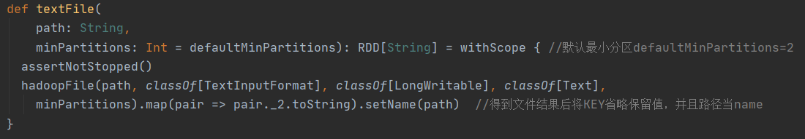
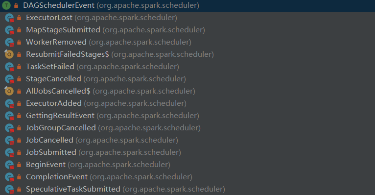
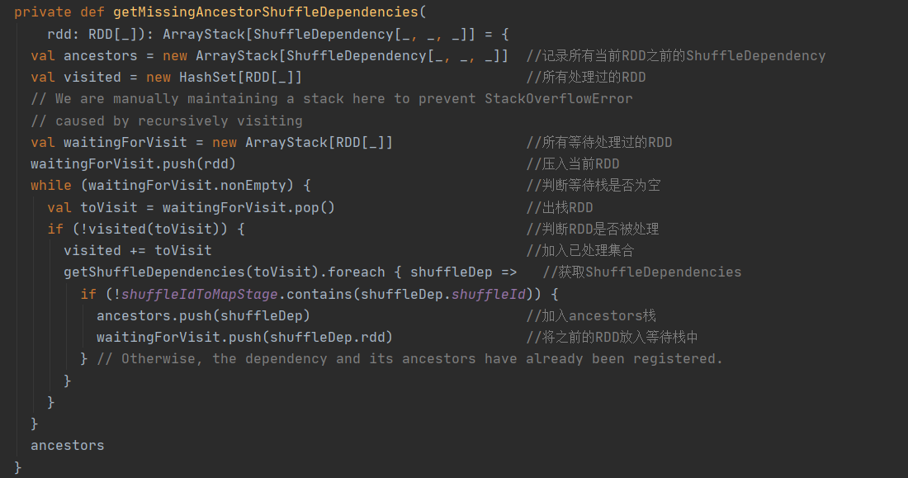
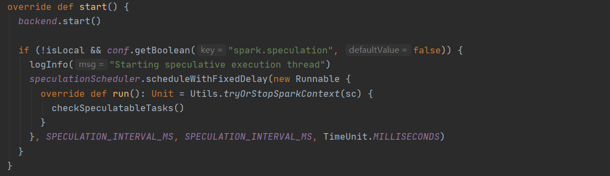
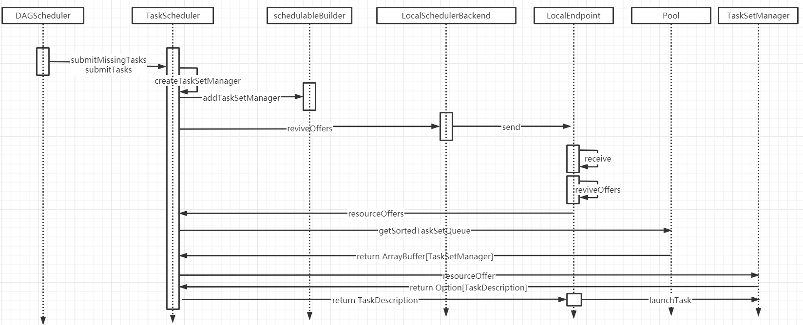

## 5 储存系统

> 块管理器BlockManager是Spark存储体系中的核心组件

- 由Driver和Executor中的BlockManager组成，采用Master-Slave架构，通过SparkRPC进行通信


| 组件                       | 备注                                                         |
| -------------------------- | ------------------------------------------------------------ |
| BlockManager               | 负责对Block的管理，管理整个Spark运行时的数据读写             |
| BlockManagerMaster         | 负责对BlockManager的管理和协调，代理BlockManager与Driver上的BlockManagerMasterEndpoint进行通信 |
| BlockManagerMasterEndpoint | 只存在于Driver上，由其向BlockManager下发指令                 |
| BlockManagerSlaveEndpoint  | 接受BlockManagerMasterEndpoint下发下来的命令，如：获取Block状态，根据BlockID获取Block，删除Block等 |

### 5.1 BlockManager初始化过程

- 在SparkEnv中的创建：NettyBlockTransferService、BlockManagerMaster、BlockManagerMasterEndpoint、BlockManager。


- BlockManagerMasterEndpoint会根据是否是在Driver节点上进行注册获得对应的RpcRef


- 在SparkContext中进行初始化


- 初始化
  1. 初始化blockTransferService
  2. 初始化shuffleClient
  3. 确定block复制策略
  4. 向master注册自己
  5. 注册本地洗牌服务(外部)

```ruby
  def initialize(appId: String): Unit = {
    //blockTransferService初始化
    blockTransferService.init(this)
    //shuffleClient初始化，需要传入appId
    shuffleClient.init(appId)

    //确定block复制策略，由 StorageLevel 决定
    blockReplicationPolicy = {
      val priorityClass = conf.get(
        "spark.storage.replication.policy", classOf[RandomBlockReplicationPolicy].getName)
      val clazz = Utils.classForName(priorityClass)
      val ret = clazz.newInstance.asInstanceOf[BlockReplicationPolicy]
      logInfo(s"Using $priorityClass for block replication policy")
      ret
    }
    //创建BlockManagerId
    val id =
      BlockManagerId(executorId, blockTransferService.hostName, blockTransferService.port, None)

    //BlockManagerMaster注册--
    val idFromMaster = master.registerBlockManager(
      id,
      maxOnHeapMemory,
      maxOffHeapMemory,
      slaveEndpoint)
    //根据idFromMaster看是返回idFromMaster还是id
    blockManagerId = if (idFromMaster != null) idFromMaster else id
    //本地洗牌服务(外部)，如果开启可以减少一部分exetutor的压力，默认不开启
    shuffleServerId = if (externalShuffleServiceEnabled) {
      logInfo(s"external shuffle service port = $externalShuffleServicePort")
      BlockManagerId(executorId, blockTransferService.hostName, externalShuffleServicePort)
    } else {
      blockManagerId
    }

    // Register Executors' configuration with the local shuffle service, if one should exist.
    if (externalShuffleServiceEnabled && !blockManagerId.isDriver) {
      registerWithExternalShuffleServer()
    }

    logInfo(s"Initialized BlockManager: $blockManagerId")
  }
```

### 5.2 Block存储

#### 5.2.1 标记BlockId


- 命名规则


#### 5.2.2 块信息BlockInfo

```ruby
private[storage] class BlockInfo(
    val level: StorageLevel,        //存储级别
    val classTag: ClassTag[_],      //存储类型，用于序列化和反序列化
    val tellMaster: Boolean) {      //block存储被改变时通知master，一般都为true，广播时因为数据不需要变动设置为false

  /**
   * The size of the block (in bytes)
   */
  def size: Long = _size        //块大小
  def size_=(s: Long): Unit = {
    _size = s
    checkInvariants()
  }
  private[this] var _size: Long = 0

  /**
   * The number of times that this block has been locked for reading.
   * 此块已被锁定以进行读取的次数。(读锁次数)
   */
  def readerCount: Int = _readerCount
  def readerCount_=(c: Int): Unit = {
    _readerCount = c
    checkInvariants()
  }
  private[this] var _readerCount: Int = 0

  /**
   * The task attempt id of the task which currently holds the write lock for this block, or
   * [[BlockInfo.NON_TASK_WRITER]] if the write lock is held by non-task code, or
   * [[BlockInfo.NO_WRITER]] if this block is not locked for writing.
   * 被任务持有的次数(写锁次数)
   */
  def writerTask: Long = _writerTask
  def writerTask_=(t: Long): Unit = {
    _writerTask = t
    checkInvariants()
  }
  private[this] var _writerTask: Long = BlockInfo.NO_WRITER

  private def checkInvariants(): Unit = {
    // A block's reader count must be non-negative:
    assert(_readerCount >= 0)
    // A block is either locked for reading or for writing, but not for both at the same time:
    assert(_readerCount == 0 || _writerTask == BlockInfo.NO_WRITER)
  }

  checkInvariants()
}

```

#### 5.2.3 维护者BlockInfoManager


#### 5.2.4 存储级别StorageLevel


#### 5.2.5 状态信息BlockStatus

> 封装向BlockManager查询Block返回信息
>
> - 存储等级
> - 占用内存大小
> - 占用磁盘大小
> - 是否在存储体系中


#### 5.2.6 数据及长度BlockResult

> 返回Block结果
>
> - 数据
> - 读取Block方法：Memory、Disk、Hadoop、Network
> - 字节长度


#### 5.2.7 转换可序列化数据BlockData

> 如何将Block转换成可序列化的数据
>
> BlockData的三个实现类：ByteBufferBlockData、EncryptedBlockData、DiskBlockData


#### 5.2.8 持久化Store

- 磁盘存储DiskStore
- 内存存储MemoryStore

#### 5.2.9 磁盘存储DiskStore

- 使用DiskBlockManager来维护 逻辑Block 和 磁盘上的Block之间的映射


- DiskBlockManager


- 获取文件方法介绍


- DiskStore写入方法介绍

```ruby
  def put(blockId: BlockId)(writeFunc: WritableByteChannel => Unit): Unit = {
    //通过diskManager.getFile获取文件标识，如果存在抛异常
    if (contains(blockId)) {
      throw new IllegalStateException(s"Block $blockId is already present in the disk store")
    }
    logDebug(s"Attempting to put block $blockId")
    val startTime = System.currentTimeMillis  //获取时间
    val file = diskManager.getFile(blockId)   //获取写入文件标识（位置）
    val out = new CountingWritableChannel(openForWrite(file)) //包装写通道Channel
    var threwException: Boolean = true
    try {
      writeFunc(out)  //写方法 writeFunc: WritableByteChannel => Unit 参考putBytes
      blockSizes.put(blockId, out.getCount) //记录Block大小
      threwException = false
    } finally {
      try {
        out.close()
      } catch {
        case ioe: IOException =>
          if (!threwException) {
            threwException = true
            throw ioe
          }
      } finally {
         if (threwException) {
          remove(blockId)
        }
      }
    }
    val finishTime = System.currentTimeMillis
    logDebug("Block %s stored as %s file on disk in %d ms".format(
      file.getName,
      Utils.bytesToString(file.length()),
      finishTime - startTime))
  }

  //调用put方法，writeFunc传入写方法(bytes.writeFully(channel))
  def putBytes(blockId: BlockId, bytes: ChunkedByteBuffer): Unit = {
    put(blockId) { channel =>
      bytes.writeFully(channel)
    }
  }
```

#### 5.2.10 内存存储MemoryStore 


> MemoryStore维护一个LinkedHashMap，里面是BlockId和MemoryEntry ，本身依赖于MemoryManager管理内存模型
>
> putBytes	数据储存方法
>
> putIteratorAsValues	存储非序列化的block
>
> putIteratorAsBytes	将block对象序列化后存储
>
> getBytes & getValues	获取内存数据方法

- MemoryEntry


> DeserializedMemoryEntry用于存储不需要序列化的对象
>
> SerializedMemoryEntry用于存放序列化后的对象


### 5.3 内存存储

#### 5.3.1 spark内存模型


- Heap内存由：启动参数 --executor-memory决定
- Overhead内存由：--executor-memory的0.1倍决定
- Off-heap内存由：
  - spark.memory.offHeap.size 设置堆外内存大小 
  - spark.memory.offHeap.enabled 设置是否启用堆外内存

#### 5.3.2 堆内内存(Heap | On-heap)

> Heap内存又称堆内内存(On-heap Memory)


- 默认情况下，Spark 仅仅使用了堆内内存。Executor 端的堆内内存区域大致可以分为以下四大块：
  - **Execution 内存**：主要用于存放 Shuffle、Join、Sort、Aggregation 等计算过程中的临时数据
  - **Storage 内存**：主要用于存储 spark 的 cache 数据，例如RDD的缓存、unroll数据；
  - **用户内存（User Memory）**：主要用于存储 RDD 转换操作所需要的数据，例如 RDD 依赖等信息，map等操作中的连接，时间转换对象
  - **预留内存（Reserved Memory）**：系统预留内存，会用来存储Spark内部对象。


- systemMemory = Runtime.getRuntime.maxMemory，其实就是通过参数 spark.executor.memory 或 --executor-memory 配置的。
- reservedMemory 在 Spark 2.4 中是写死的，其值等于 300MB，这个值是不能修改的（如果在测试环境下，我们可以通过 spark.testing.reservedMemory 参数进行修改）；
- usableMemory = systemMemory - reservedMemory，这个就是 Spark 可用内存；

#### 5.3.3 堆外内存(Off-heap Memory)

- Off-heap内存由：
  - spark.memory.offHeap.size 设置堆外内存大小 
  - spark.memory.offHeap.enabled 设置是否启用堆外内存

> 相比堆内内存，堆外内存 只区分 Execution 内存和 Storage 内存，其内存分布如下图所示：


- 上图中的 *maxOffHeapMemory* 等于 *spark.memory.offHeap.size* 参数配置的。

#### 5.3.4 统一内存管理UnifiedMemoryManager

- 在 Spark 1.6 之前，Execution 内存和 Storage 内存分配是静态的，换句话说就是如果 Execution 内存不足，即使 Storage 内存有很大空闲程序也是无法利用到的；反之亦然。
- 这就导致我们很难进行内存的调优工作，我们必须非常清楚地了解 Execution 和 Storage 两块区域的内存分布。而目前 Execution 内存和 Storage 内存可以互相共享的。也就是说，如果 Execution 内存不足，而 Storage 内存有空闲，那么 Execution 可以从 Storage 中申请空间；反之亦然。
- <font color=red>所以5.3.2和5.3.3图中的虚线代表 Execution 内存和 Storage 内存是可以随着运作动态调整的</font>，这样可以有效地利用内存资源。Execution 内存和 Storage 内存之间的动态调整可以概括如下：


- 具体的实现逻辑如下：
  - 程序提交的时候我们都会设定基本的 Execution 内存和 Storage 内存区域（通过 spark.memory.storageFraction参数设置）；
  - 在程序运行时，如果双方的空间都不足时，则存储到硬盘；将内存中的块存储到磁盘的策略是按照 LRU 规则进行的。若己方空间不足而对方空余时，可借用对方的空间;（存储空间不足是指不足以放下一个完整的 Block）
  - Execution 内存的空间被对方占用后，可让对方将占用的部分转存到硬盘，然后"归还"借用的空间
  - Storage 内存的空间被对方占用后，目前的实现是无法让对方"归还"，因为需要考虑 Shuffle 过程中的很多因素，实现起来较为复杂；而且 Shuffle 过程产生的文件在后面一定会被使用到，而 Cache 在内存的数据不一定在后面使用。

> 注意，上面说的借用对方的内存需要借用方和被借用方的内存类型都一样，都是 堆内内存 或者都是 堆外内存，不存在堆内内存不够去借用堆外内存的空间。

#### 5.3.5 内存池模型

> 为了管理内存的增加、减少，Spark使用内存池MempryPool来形容该模型。


- MemoryPool

```ruby
private[memory] abstract class MemoryPool(lock: Object) {

  @GuardedBy("lock")
  private[this] var _poolSize: Long = 0

  /**
   * Returns the current size of the pool, in bytes.
   * 返回池的当前大小
   */
  final def poolSize: Long = lock.synchronized {
    _poolSize
  }

  /**
   * Returns the amount of free memory in the pool, in bytes.
   * 返回池中的可用内存量
   */
  final def memoryFree: Long = lock.synchronized {
    _poolSize - memoryUsed
  }

  /**
   * Expands the pool by `delta` bytes.
   * 扩展池
   */
  final def incrementPoolSize(delta: Long): Unit = lock.synchronized {
    require(delta >= 0)
    _poolSize += delta
  }

  /**
   * Shrinks the pool by `delta` bytes.
   * 缩小池
   */
  final def decrementPoolSize(delta: Long): Unit = lock.synchronized {
    require(delta >= 0)
    require(delta <= _poolSize)
    require(_poolSize - delta >= memoryUsed)
    _poolSize -= delta
  }

  /**
   * Returns the amount of used memory in this pool (in bytes).
   * 返回此池中已使用的内存量
   */
  def memoryUsed: Long
}
```

- StorageMemoryPool申请空间解析

```ruby
  /**
   *         numBytes：为需要申请的内存大小，
   *         memoryFree：为空闲的Storage储存空间
   */
  def acquireMemory(blockId: BlockId, numBytes: Long): Boolean = lock.synchronized {
    val numBytesToFree = math.max(0, numBytes - memoryFree)//如果此值大于0，那么证明空间不足，需要释放后才可以进行存储
    acquireMemory(blockId, numBytes, numBytesToFree)
  }

  def acquireMemory(
      blockId: BlockId,
      numBytesToAcquire: Long,
      numBytesToFree: Long): Boolean = lock.synchronized {
    assert(numBytesToAcquire >= 0)
    assert(numBytesToFree >= 0)
    assert(memoryUsed <= poolSize)
    if (numBytesToFree > 0) {
      memoryStore.evictBlocksToFreeSpace(Some(blockId), numBytesToFree, memoryMode) //释放资源
    }
    // NOTE: If the memory store evicts blocks, then those evictions will synchronously call
    // back into this StorageMemoryPool in order to free memory. Therefore, these variables
    // should have been updated.
    val enoughMemory = numBytesToAcquire <= memoryFree
    if (enoughMemory) {   //判断空间是否充足
      _memoryUsed += numBytesToAcquire
    }
    enoughMemory
  }
```

- ExecutionMemoryPool申请空间解析


```ruby
  private[memory] def acquireMemory(
      numBytes: Long,         //需要申请的内存大小
      taskAttemptId: Long,    //任务尝试ID
      maybeGrowPool: Long => Unit = (additionalSpaceNeeded: Long) => Unit,  //从StorageMemoryPool回收或借用内存
      computeMaxPoolSize: () => Long = () => poolSize): Long = lock.synchronized {  //当前允许池最大大小
    assert(numBytes > 0, s"invalid number of bytes requested: $numBytes")

    // TODO: clean up this clunky method signature

    // Add this task to the taskMemory map just so we can keep an accurate count of the number
    // of active tasks, to let other tasks ramp down their memory in calls to `acquireMemory`
    //将此任务添加到taskMemory映射中，以便我们可以准确计数活动任务的数量
    if (!memoryForTask.contains(taskAttemptId)) {  //memoryForTask中不存在taskAttemptId
      memoryForTask(taskAttemptId) = 0L
      // This will later cause waiting tasks to wake up and check numTasks again
      lock.notifyAll()
    }

    // Keep looping until we're either sure that we don't want to grant this request (because this
    // task would have more than 1 / numActiveTasks of the memory) or we have enough free
    // memory to give it (we always let each task get at least 1 / (2 * numActiveTasks)).
    //继续循环，直到我们确定不想批准该请求（因为此任务会拥有超过1 / numActiveTasks个内存）
    // 或者我们有足够的空闲//内存来给予它（我们总是让每个任务至少获得1 /（2 * numActiveTasks）
    // TODO: simplify this to limit each task to its own slot
    while (true) {
      val numActiveTasks = memoryForTask.keys.size  //激活Tasks数量
      val curMem = memoryForTask(taskAttemptId)     //Task尝试ID对应内存

      // In every iteration of this loop, we should first try to reclaim any borrowed execution
      // space from storage. This is necessary because of the potential race condition where new
      // storage blocks may steal the free execution memory that this task was waiting for.
      // 要求StorageMemoryPool退还借用ExecutionMemoryPool的空间
      maybeGrowPool(numBytes - memoryFree)

      // Maximum size the pool would have after potentially growing the pool.
      // This is used to compute the upper bound of how much memory each task can occupy. This
      // must take into account potential free memory as well as the amount this pool currently
      // occupies. Otherwise, we may run into SPARK-12155 where, in unified memory management,
      // we did not take into account space that could have been freed by evicting cached blocks.
      val maxPoolSize = computeMaxPoolSize()  //计算任务可以用到的最大内存
      val maxMemoryPerTask = maxPoolSize / numActiveTasks   //计算每个任务可以用到的最大内存
      val minMemoryPerTask = poolSize / (2 * numActiveTasks)//计算每个任务可以用到的最小内存
      /**从上面推出 每个taskAttemptId可用的内存范围为 total/2n <= memory <= total/n */

      // How much we can grant this task; keep its share within 0 <= X <= 1 / numActiveTasks
      //理论上可以分配个任务的内存，需要内存数和可获得内存数最小值
      val maxToGrant = math.min(numBytes, math.max(0, maxMemoryPerTask - curMem))
      // Only give it as much memory as is free, which might be none if it reached 1 / numTasks
      //实际分配内存，理论计算值和实际剩余内存值最小值
      val toGrant = math.min(maxToGrant, memoryFree)

      // We want to let each task get at least 1 / (2 * numActiveTasks) before blocking;
      // if we can't give it this much now, wait for other tasks to free up memory
      // (this happens if older tasks allocated lots of memory before N grew)
      //如果计算的内存小于了需要的内存，那么进行阻塞，等待其他任务将其唤醒
      //否则进行内存获取
      if (toGrant < numBytes && curMem + toGrant < minMemoryPerTask) {
        logInfo(s"TID $taskAttemptId waiting for at least 1/2N of $poolName pool to be free")
        lock.wait()
      } else {
        memoryForTask(taskAttemptId) += toGrant
        return toGrant
      }
    }
    0L  // Never reached
  }
```

#### 5.3.6 内存管理者 MemoryManager


- sparkEnv中可以看出目前使用的已经是UnifiedMemoryManager统一内存管理了


##### 5.3.6.1 内存大小初始化

- On-Heap两个区域的大小由构造参数输入
- Off-Heap两个区域的大小由配置文件决定


- UnifiedMemoryManager中可以看出ReservedMemory=300M


##### 5.3.6.2 UnifiedMemoryManager计算内存过程


- 统一内存管理内存计算总结：

| 内存类型        | 大小                          |
| --------------- | ----------------------------- |
| MaxMemory       | Container Total Memory - 300M |
| ExecutionMemory | MaxMemory * 0.6 * 0.5         |
| StorageMemory   | MaxMemory * 0.6 * 0.5         |
| UserMemory      | MaxMemory * 0.4               |

##### 5.4.6.3 UnifiedMemoryManager资源借用

- ExecutionMemory空闲时可以被StorageMemory借用


```ruby
override def acquireStorageMemory(
    blockId: BlockId,
    numBytes: Long,
    memoryMode: MemoryMode): Boolean = synchronized {
  assertInvariants()
  assert(numBytes >= 0)
  val (executionPool, storagePool, maxMemory) = memoryMode match {
      //匹配是 堆外内存 还是 对内内存
    case MemoryMode.ON_HEAP => (
      onHeapExecutionMemoryPool,
      onHeapStorageMemoryPool,
      maxOnHeapStorageMemory)
    case MemoryMode.OFF_HEAP => (
      offHeapExecutionMemoryPool,
      offHeapStorageMemoryPool,
      maxOffHeapStorageMemory)
  }
  if (numBytes > maxMemory) { //如果需要空间大于计算出的空间 那么返回false
    // Fail fast if the block simply won't fit
    logInfo(s"Will not store $blockId as the required space ($numBytes bytes) exceeds our " +
      s"memory limit ($maxMemory bytes)")
    return false
  }
  if (numBytes > storagePool.memoryFree) { //如果storage中需要使用的内存 大于了 目前storage的空间，而上面的判断说明executor有空间,那么开始借空间操作
    // There is not enough free memory in the storage pool, so try to borrow free memory from
    // the execution pool.
    val memoryBorrowedFromExecution = Math.min(executionPool.memoryFree,
      numBytes - storagePool.memoryFree)  // execution可用空间 和 storage不够的空间取最小值
    executionPool.decrementPoolSize(memoryBorrowedFromExecution)  //execution减少空间
    storagePool.incrementPoolSize(memoryBorrowedFromExecution)    //storage增加空间
  }
  storagePool.acquireMemory(blockId, numBytes)  //storagePool申请空间
}
```

- ExecutionMemory借用StorageMemory空间，或者让StorageMemory归还占用空间

```ruby
  override private[memory] def acquireExecutionMemory(
      numBytes: Long,
      taskAttemptId: Long,
      memoryMode: MemoryMode): Long = synchronized {
    assertInvariants()
    assert(numBytes >= 0)
    val (executionPool, storagePool, storageRegionSize, maxMemory) = memoryMode match {
        //判断是堆内内存 还是 堆外内存
      case MemoryMode.ON_HEAP => (
        onHeapExecutionMemoryPool,
        onHeapStorageMemoryPool,
        onHeapStorageRegionSize,
        maxHeapMemory)
      case MemoryMode.OFF_HEAP => (
        offHeapExecutionMemoryPool,
        offHeapStorageMemoryPool,
        offHeapStorageMemory,
        maxOffHeapMemory)
    }

    def maybeGrowExecutionPool(extraMemoryNeeded: Long): Unit = {
      if (extraMemoryNeeded > 0) {  // 需要额外的内存>0
        // There is not enough free memory in the execution pool, so try to reclaim memory from
        // storage. We can reclaim any free memory from the storage pool. If the storage pool
        // has grown to become larger than `storageRegionSize`, we can evict blocks and reclaim
        // the memory that storage has borrowed from execution.
        val memoryReclaimableFromStorage = math.max(  //计算storage可利用 或者 可回收资源
          storagePool.memoryFree,
          storagePool.poolSize - storageRegionSize)
        if (memoryReclaimableFromStorage > 0) { // 可利用 或者 可回收资源>0
          // Only reclaim as much space as is necessary and available:
          val spaceToReclaim = storagePool.freeSpaceToShrinkPool(     // 收缩storage空间
            math.min(extraMemoryNeeded, memoryReclaimableFromStorage))
          storagePool.decrementPoolSize(spaceToReclaim)   //storage减少收缩后的空间
          executionPool.incrementPoolSize(spaceToReclaim) //execution增加收缩后的空间
        }
      }
    }

    def computeMaxExecutionPoolSize(): Long = {   //计算最大Execution可使用的空间
      maxMemory - math.min(storagePool.memoryUsed, storageRegionSize)
    }

    executionPool.acquireMemory(
      numBytes, taskAttemptId, maybeGrowExecutionPool, () => computeMaxExecutionPoolSize)
  }
```


#### 5.3.7 静态内存管理StaticMemoryManager(拓展)

> 在 Spark 最初采用的静态内存管理机制下，存储内存、执行内存和其他内存的大小在 Spark 应用程序运行期间均为固定的，但用户可以应用程序启动前进行配置

- 静态内存管理图-堆内(无堆外)


>可用的堆内内存的大小需要按照下面的方式计算

1. 可用的存储内存 = systemMaxMemory * spark.storage.memoryFraction * spark.storage.safetyFraction
2. 可用的执行内存 = systemMaxMemory * spark.shuffle.memoryFraction * spark.shuffle.safetyFraction

> 其中 systemMaxMemory 取决于当前 JVM 堆内内存的大小，最后可用的执行内存或者存储内存要在此基础上与各自的 memoryFraction 参数和 safetyFraction 参数相乘得出。上述计算公式中的两个 safetyFraction 参数，其意义在于在逻辑上预留出 1-safetyFraction 这么一块保险区域，降低因实际内存超出当前预设范围而导致 OOM 的风险(上文提到，对于非序列化对象的内存采样估算会产生误差)。值得注意的是，这个预留的保险区域仅仅是一种逻辑上的规划，在具体使用时 Spark 并没有区别对待，和“其它内存”一样交给了 JVM 去管理。

>静态内存管理机制实现起来较为简单，但如果用户不熟悉 Spark 的存储机制，或没有根据具体的数据规模和计算任务或做相应的配置，很容易造成"一半海水，一半火焰"的局面，即存储内存和执行内存中的一方剩余大量的空间，而另一方却早早被占满，不得不淘汰或移出旧的内容以存储新的内容。由于新的内存管理机制的出现，这种方式目前已经很少有开发者使用，出于兼容旧版本的应用程序的目的，Spark 仍然保留了它的实现。

### 5.4 RDD Partition与Block的转化

> spark是以Block为单位进行储存，RDD运算以Partition为单位

- RDD中的tierator方法是联系Block的关键


## 6 Spark调度

### 6.1 RDD：介绍

- Resilient Distributed DataSet：弹性分布式数据集，是Spark中最基本数据抽象，可以理解为数据集合。
  - **Dataset**:         数据集合，存储很多数据.
  - **Distributed**：RDD内部的元素进行了分布式存储，方便于后期进行分布式计算.
  - **Resilient**：     表示弹性，RDD的数据是可以保存在内存或者是磁盘中.

- 在代码中是一个抽象类，它代表一个弹性的、不可变的、可分区，里面的元素可并行计算的集合。

- RDD的五个主要特性


1. A list of partitions(分区性)

   - RDD有很多分区，每一个分区内部是包含了该RDD的部分数据
   - 因为有多个分区，那么一个分区（Partition）列表，就可以看作是数据集的基本组成单位
   - spark中任务是以task线程的方式运行，对于RDD来说，每个分区都会被一个计算任务处理， 一个分区就对应一个task线程，故分区就决定了并行计算的粒度。
   - 用户可以在创建RDD时，指定RDD的分区数，如果没有指定，那么采用默认值（程序所分配到的CPU Coure的数目）
   - 每个分配的储存是由BlockManager实现的，每个分区都会被逻辑映射成BlockManager的一个Block，而这个Block会被一个Task负责计算。

2. A function for computing each split(计算每个分区的函数)

   - Spark中RDD的计算是以分区为单位的，每个RDD都会实现compute函数以达到这个目的

3. A list of dependencies on other RDDs(依赖性--一个rdd会依赖于其他多个rdd)

   - spark任务的容错机制就是根据这个特性（血统）而来。
   - RDD的每次转换都会生成一个新的RDD，所以RDD之间会形成类似于流水线一样的前后依赖关系，在部分分区数据丢失时，Spark可以通过这个依赖关系重新计算丢失的分区数据，而不是对RDD的所有分区进行重新计算。

4. Optionally, a Partitioner for key-value RDDs (e.g. to say that the RDD is hash-partitioned)--(对储存键值对的RDD，还有一个可选的分区器)
   - 只有对于key-value的RDD(RDD[(String, Int)]),并且产生shuffle，才会有Partitioner，非key-value的RDD(RDD[String])的Parititioner的值是None。
   - Partitioner不但决定了RDD的分区数量，也决定了parent RDD Shuffle输出时的分区数量
   - 当前Spark中实现了两种类型的分区函数，一个是基于哈希的HashPartitioner，(key.hashcode % 分区数= 分区号)。它是默认值，另外一个是基于范围的RangePartitioner。

5. Optionally, a list of preferred locations to compute each split on (e.g. block locations for an HDFS file)--(储存每个分区优先位置的列表(本地计算性)

   - 比如对于一个HDFS文件来说，这个列表保存的就是每个Partition所在文件快的位置，按照“移动数据不如移动计算”的理念，Spark在进行任务调度的时候，会尽可能地将计算任务分配到其所要处理数据块的储存位置，减少数据的网络传输，提升计算效率。

### 6.2 RDD：通过textFile分析分区

- SparkContext中的textFile方法



- hadoopFile方法


- HadoopRDD的getPartitions获取分区方法


### 6.3 RDD：依赖关系怎么依赖


- RDD和它依赖的父RDD的关系有两种不同的类型：
  - 窄依赖（narrow dependency）：子RDD与父RDD的分区是一一对应关系
  - 宽依赖（wide dependency）：子RDD依赖父RDD的一个或者多个分区


- 窄依赖


> MapPartitionsRDD继承RDD


- 宽依赖

```ruby
import org.apache.spark.{SparkConf, SparkContext}

object GroupByKeyTest {
  def main(args: Array[String]): Unit = {
    val conf = new SparkConf().setAppName("WorkCount").setMaster("local[*]")
    val sc = new SparkContext(conf)
    val kv = sc.parallelize(Array(("key1" -> 10), ("key2" -> 11), ("key1" -> 12), ("key1" -> 13)),3)
    kv.groupByKey().collect().foreach(println)
    //(key1,CompactBuffer(10, 12, 13))
    //(key2,CompactBuffer(11))
  }
}
```


> ShuffledRDD中getDependencies方法中创建ShuffleDependency


### 6.4 Stage：介绍

- DAGScheduler负责划分RDD到不同的Stage
- 一个Job会被拆分为多组Task，每组任务被称为一个stage
- stage表示不同的调度阶段，一个spark job会对应产生很多个stage，stage类型一共有2种
  - ShuffleMapStage
    - 最后一个shuffle之前的所有变换的Stage叫ShuffleMapStage
      - 它对应的task是shuffleMapTask
  - ResultStage(FinalStage)
    - 最后一个shuffle之后操作的Stage叫ResultStage，它是最后一个Stage。
      - 它对应的task是ResultTask
    - ResultStage对应代码中的action算子，即将一个函数应用在RDD的各个Partition（分区）的数据集上，意味着一个Job运行结束


### 6.5 Stage：结构

- Stage


- ShuffleMapStage


- ResultStage


### 6.6 DAG：执行流程


(1) Driver端运行客户端的main方法，构建SparkContext对象，在SparkContext对象内部依次构建DAGScheduler和TaskScheduler

(2) 按照rdd的一系列操作顺序，来生成DAG有向无环图

(3) DAGScheduler拿到DAG有向无环图之后，按照宽依赖进行stage的划分。每一个stage内部有很多可以并行运行的task，最后封装在一个一个的taskSet集合中，然后把taskSet发送给TaskScheduler

(4) TaskScheduler得到taskSet集合之后，依次遍历取出每一个task提交到worker节点上的executor进程中运行。

(5) 所有task运行完成，整个任务也就结束了

### 6.7 DAG：DAG调度器DAGScheduler介绍

- DAGScheduler 主要用于在任务正式交给 TaskSchedulerImpl 提交之前做一些准备工作，包括：创建 Job，将 DAG 中的 RDD 划分到不同的 Stage，提交 Stage，等等。


- DAGScheduler 的数据结构主要维护 jobId 和 stageId 的关系、Stage、ActiveJob，以及缓存的 RDD 的 partitions 的位置信息，如下代码为主要数据结构

```ruby
  /** 维护数据结构 */
  private[scheduler] val nextJobId = new AtomicInteger(0) //下一个jobid
  private[scheduler] def numTotalJobs: Int = nextJobId.get()  //总共job数
  private val nextStageId = new AtomicInteger(0)  //下一个StageId

  private[scheduler] val jobIdToStageIds = new HashMap[Int, HashSet[Int]]  //job拥有stage数
  private[scheduler] val stageIdToStage = new HashMap[Int, Stage] //stage到stage

  private[scheduler] val shuffleIdToMapStage = new HashMap[Int, ShuffleMapStage]  //ShuffleMapStageId
  private[scheduler] val jobIdToActiveJob = new HashMap[Int, ActiveJob] //生效jobID

  private[scheduler] val waitingStages = new HashSet[Stage] //等待tage

  private[scheduler] val runningStages = new HashSet[Stage] //运行stage

  private[scheduler] val failedStages = new HashSet[Stage]  //失败stage

  private[scheduler] val activeJobs = new HashSet[ActiveJob]  //生效job集合

  private val cacheLocs = new HashMap[Int, IndexedSeq[Seq[TaskLocation]]] //缓存地址集

  private val failedEpoch = new HashMap[String, Long] //失败节点集
```

### 6.8 DAG：事件循环处理器

- DAGSchedulerEventProcessLoop是DAGScheduler中的一个内部事件循环处理器，负责事件的接收和处理


- EventLoop通过post()方法将事件放入事件队列(eventQueue)，事件线程稍后将对其进行处理。
- EventLoop另起线程去不停的取eventQueue列队中的事件，在通过子类重写onReceive()方法来处理事件

> 如上可以看出onReceive需要传入的是DAGSchedulerEvent

- DAGSchedulerEvent实现类



### 6.9 DAG：Job提交调用链

1. 首先action算子执行，传入分区处理函数


2. 调用runJob方法，继续传入分区函数作用域哪些分区


3. 包装执行函数，继续向下调用


4. 创建新的储存数组，向下调用时传入函数给数组赋值，最终做到数据返回


5. 执行runJob会去调用dagScheduler的runJob方法，传入rdd，作用域每个分区的函数，分区数，调用栈信息，返回处理函数，配置信息


6. dagScheduler中的runJob方法会去调用submitJob方法，返回JobWaiter(resutHandler返回执行函数在这里调用填充)


> JobSubmitted事件是Stage构建的入口，请参照6.10

7. JobWaiter最终执行taskSucceeded方法填充结果集


8. taskSucceeded是在DAGScheduler收到CompletionEvent事件时调用


### 6.10 DAG：Stage构建过程

- JobSubmitted事件是Stage构建的入口


```ruby
  private[scheduler] def handleJobSubmitted(jobId: Int,
      finalRDD: RDD[_],                         //
      func: (TaskContext, Iterator[_]) => _,
      partitions: Array[Int],
      callSite: CallSite,
      listener: JobListener,
      properties: Properties) {
    var finalStage: ResultStage = null
    try {
      // New stage creation may throw an exception if, for example, jobs are run on a
      // HadoopRDD whose underlying HDFS files have been deleted.
      finalStage = createResultStage(finalRDD, func, partitions, jobId, callSite) //1.创建最终FinalStage(ResultStage)
    } catch {
      case e: BarrierJobSlotsNumberCheckFailed =>
        logWarning(s"The job $jobId requires to run a barrier stage that requires more slots " +
          "than the total number of slots in the cluster currently.")
        // If jobId doesn't exist in the map, Scala coverts its value null to 0: Int automatically.
        val numCheckFailures = barrierJobIdToNumTasksCheckFailures.compute(jobId,
          new BiFunction[Int, Int, Int] {
            override def apply(key: Int, value: Int): Int = value + 1
          })
        if (numCheckFailures <= maxFailureNumTasksCheck) {
          messageScheduler.schedule(
            new Runnable {
              override def run(): Unit = eventProcessLoop.post(JobSubmitted(jobId, finalRDD, func,
                partitions, callSite, listener, properties))
            },
            timeIntervalNumTasksCheck,
            TimeUnit.SECONDS
          )
          return
        } else {
          // Job failed, clear internal data.
          barrierJobIdToNumTasksCheckFailures.remove(jobId)
          listener.jobFailed(e)
          return
        }

      case e: Exception =>
        logWarning("Creating new stage failed due to exception - job: " + jobId, e)
        listener.jobFailed(e)
        return
    }
    // Job submitted, clear internal data.
    barrierJobIdToNumTasksCheckFailures.remove(jobId)

    val job = new ActiveJob(jobId, finalStage, callSite, listener, properties)  //2.生成ActiveJob
    clearCacheLocs()
    logInfo("Got job %s (%s) with %d output partitions".format(
      job.jobId, callSite.shortForm, partitions.length))
    logInfo("Final stage: " + finalStage + " (" + finalStage.name + ")")
    logInfo("Parents of final stage: " + finalStage.parents)
    logInfo("Missing parents: " + getMissingParentStages(finalStage))

    val jobSubmissionTime = clock.getTimeMillis()
    jobIdToActiveJob(jobId) = job
    activeJobs += job
    finalStage.setActiveJob(job)  //3.将job添加进finalStage
    val stageIds = jobIdToStageIds(jobId).toArray
    val stageInfos = stageIds.flatMap(id => stageIdToStage.get(id).map(_.latestInfo))
    listenerBus.post(
      SparkListenerJobStart(job.jobId, jobSubmissionTime, stageInfos, properties))  //提交之前投递JobStart到生命总线bus，这样UI就可以看见Job提交
    submitStage(finalStage) //4.提交计算
  }
```

- createResultStage方法


- getOrCreateParentStages方法


> getShuffleDependencies方法用于获取直接的shuffle依赖（宽依赖）
>
> 如：下图中获取的则是 B和D


> getOrCreateShuffleMapStage方法，将上述方法拿到的直接宽依赖进行处理


> getMissingAncestorShuffleDependencies方法用于获取所有的shuffle依赖（宽依赖）



- 最终形成图


### 6.11 DAG：Stage提交流程

- handleJobSubmitted最后一行submitStage(finalStage)为入口


- submitMissingTasks方法用于提交Stage

```ruby
  private def submitMissingTasks(stage: Stage, jobId: Int) {
    logDebug("submitMissingTasks(" + stage + ")")

    // First figure out the indexes of partition ids to compute.
    //1. 当前Stage没有计算完的分区对应的索引
    val partitionsToCompute: Seq[Int] = stage.findMissingPartitions()

    // Use the scheduling pool, job group, description, etc. from an ActiveJob associated
    // with this Stage
    //2. 关联ActiveJob中的调度池，作业组，描述等
    val properties = jobIdToActiveJob(jobId).properties

    runningStages += stage  //3. 将当前stage加入runningStages集合
    // SparkListenerStageSubmitted should be posted before testing whether tasks are
    // serializable. If tasks are not serializable, a SparkListenerStageCompleted event
    // will be posted, which should always come after a corresponding SparkListenerStageSubmitted
    // event.
    //4. 根据Stage类别，计算分区位置
    stage match {
      case s: ShuffleMapStage =>
        outputCommitCoordinator.stageStart(stage = s.id, maxPartitionId = s.numPartitions - 1)
      case s: ResultStage =>
        outputCommitCoordinator.stageStart(
          stage = s.id, maxPartitionId = s.rdd.partitions.length - 1)
    }
    val taskIdToLocations: Map[Int, Seq[TaskLocation]] = try {
      stage match {
        case s: ShuffleMapStage =>
          partitionsToCompute.map { id => (id, getPreferredLocs(stage.rdd, id))}.toMap
        case s: ResultStage =>
          partitionsToCompute.map { id =>
            val p = s.partitions(id)
            (id, getPreferredLocs(stage.rdd, p))
          }.toMap
      }
    } catch {
      case NonFatal(e) =>
        stage.makeNewStageAttempt(partitionsToCompute.size)
        listenerBus.post(SparkListenerStageSubmitted(stage.latestInfo, properties))
        abortStage(stage, s"Task creation failed: $e\n${Utils.exceptionString(e)}", Some(e))
        runningStages -= stage
        return
    }

    stage.makeNewStageAttempt(partitionsToCompute.size, taskIdToLocations.values.toSeq)

    // If there are tasks to execute, record the submission time of the stage. Otherwise,
    // post the even without the submission time, which indicates that this stage was
    // skipped.
    if (partitionsToCompute.nonEmpty) {
      stage.latestInfo.submissionTime = Some(clock.getTimeMillis())
    }
    //5. 投递SparkListenerStageSubmitted事件到listenerBus
    listenerBus.post(SparkListenerStageSubmitted(stage.latestInfo, properties))

    // TODO: Maybe we can keep the taskBinary in Stage to avoid serializing it multiple times.
    // Broadcasted binary for the task, used to dispatch tasks to executors. Note that we broadcast
    // the serialized copy of the RDD and for each task we will deserialize it, which means each
    // task gets a different copy of the RDD. This provides stronger isolation between tasks that
    // might modify state of objects referenced in their closures. This is necessary in Hadoop
    // where the JobConf/Configuration object is not thread-safe.
    var taskBinary: Broadcast[Array[Byte]] = null
    var partitions: Array[Partition] = null
    try {
      // For ShuffleMapTask, serialize and broadcast (rdd, shuffleDep).
      // For ResultTask, serialize and broadcast (rdd, func).
      var taskBinaryBytes: Array[Byte] = null
      // taskBinaryBytes and partitions are both effected by the checkpoint status. We need
      // this synchronization in case another concurrent job is checkpointing this RDD, so we get a
      // consistent view of both variables.
      RDDCheckpointData.synchronized {
        taskBinaryBytes = stage match {
          //6. 根据stage类别，选择对应的序列化方式
          case stage: ShuffleMapStage =>    //对rdd,shuffleDep进行序列化
            JavaUtils.bufferToArray(
              closureSerializer.serialize((stage.rdd, stage.shuffleDep): AnyRef))
          case stage: ResultStage =>        //对rdd，和分区计算函数func进行序列化
            JavaUtils.bufferToArray(closureSerializer.serialize((stage.rdd, stage.func): AnyRef))
        }

        partitions = stage.rdd.partitions
      }
      //7. 将序列化对象进行广播
      taskBinary = sc.broadcast(taskBinaryBytes)
    } catch {
      // In the case of a failure during serialization, abort the stage.
      case e: NotSerializableException =>
        abortStage(stage, "Task not serializable: " + e.toString, Some(e))
        runningStages -= stage

        // Abort execution
        return
      case NonFatal(e) =>
        abortStage(stage, s"Task serialization failed: $e\n${Utils.exceptionString(e)}", Some(e))
        runningStages -= stage
        return
    }

    val tasks: Seq[Task[_]] = try {
      val serializedTaskMetrics = closureSerializer.serialize(stage.latestInfo.taskMetrics).array()
      stage match {
          //8. 根据stage类别，生成对应Task
        case stage: ShuffleMapStage =>
          stage.pendingPartitions.clear()
          partitionsToCompute.map { id =>   //对每个分区创建ShuffleMapTask
            val locs = taskIdToLocations(id)
            val part = partitions(id)
            stage.pendingPartitions += id
            new ShuffleMapTask(stage.id, stage.latestInfo.attemptNumber,
              taskBinary, part, locs, properties, serializedTaskMetrics, Option(jobId),
              Option(sc.applicationId), sc.applicationAttemptId, stage.rdd.isBarrier())
          }

        case stage: ResultStage =>
          partitionsToCompute.map { id =>   //对每个分区创建ResultTask
            val p: Int = stage.partitions(id)
            val part = partitions(p)
            val locs = taskIdToLocations(id)
            new ResultTask(stage.id, stage.latestInfo.attemptNumber,
              taskBinary, part, locs, id, properties, serializedTaskMetrics,
              Option(jobId), Option(sc.applicationId), sc.applicationAttemptId,
              stage.rdd.isBarrier())
          }
      }
    } catch {
      case NonFatal(e) =>
        abortStage(stage, s"Task creation failed: $e\n${Utils.exceptionString(e)}", Some(e))
        runningStages -= stage
        return
    }
    //9. 如果TaskSet不为空，则调用taskScheduler.submitTasks提交任务
    if (tasks.size > 0) {
      logInfo(s"Submitting ${tasks.size} missing tasks from $stage (${stage.rdd}) (first 15 " +
        s"tasks are for partitions ${tasks.take(15).map(_.partitionId)})")
      taskScheduler.submitTasks(new TaskSet(            //递交task给taskScheduler进行执行
        tasks.toArray, stage.id, stage.latestInfo.attemptNumber, jobId, properties))
    } else {
      // Because we posted SparkListenerStageSubmitted earlier, we should mark
      // the stage as completed here in case there are no tasks to run
      markStageAsFinished(stage, None)

      stage match {
        case stage: ShuffleMapStage =>
          logDebug(s"Stage ${stage} is actually done; " +
              s"(available: ${stage.isAvailable}," +
              s"available outputs: ${stage.numAvailableOutputs}," +
              s"partitions: ${stage.numPartitions})")
          markMapStageJobsAsFinished(stage)
        case stage : ResultStage =>
          logDebug(s"Stage ${stage} is actually done; (partitions: ${stage.numPartitions})")
      }
      submitWaitingChildStages(stage)
    }
  }
```

### 6.12 TASK：TASK调度器TaskScheduler介绍


- 在SparkContext中进行创建，TaskScheduler 也是 SparkContext 的重要组成部分，负责任务的提交，并且请求集群管理

  器对任务调度。TaskScheduler 也可以看做任务调度的客户端。


- createTaskScheduler方法会根据 master 的配置匹配部署模式，创建 TaskSchedulerImpl，并生成不同的 SchedulerBackend。 这里为了简单理解Spark 的初始化流程，故以 local模式为例


### 6.13 TASK：TaskSchedulerImpl介绍

- TaskSchedulerImpl 的构造过程如下：

1. 从 SparkConf 中读取配置信息，包括每个任务分配的 CPU 数、调度模式（调度模式有FAIR 和 FIFO 两种，默认为 FIFO，可以修改属性 spark.scheduler.mode 来改变）等。


2. 创建 TaskResultGetter，它的作用是通过线程池（Executors.newFixedThreadPool 创建的，默认 4 个线程，线程名字以 task-result-getter 开头，线程工厂默认是 Executors.default-ThreadFactory）对 Worker 上的 Executor 发送的 Task 的执行结果进行处理。


- TaskSchedulerImpl 的调度模式有 FAIR 和 FIFO 两 种。 任务的最终调度实际都是落实到接口 SchedulerBackend 的具体实现上的。



### 6.14 LocalSchedulerBackend调度介绍

> 以local模式为例，实际调度由LocalSchedulerBackend来进行，这里为了简单，故以此介绍
>
> 以yarn模式为例，实际调度由CoarseGrainedSchedulerBackend来进行


- DAGScheduler中可以看出递交任务给TaskScheduler执行使用submitTasks方法


- submitTasks方法最终会去使用backend.reviveOffers() 发送议案


- 这時LocalSchedulerBackend会去调用其RPC通信发送议案


- 而此localEndpoint是在执行时创建的


- 既然是RPC那么我们只需要关心接收处理即可receive()方法


```ruby
  def resourceOffers(offers: IndexedSeq[WorkerOffer]): Seq[Seq[TaskDescription]] = synchronized {
    // Mark each slave as alive and remember its hostname
    // Also track if new executor is added
    var newExecAvail = false
    //对每个offer进行一些初始化操作
    for (o <- offers) {
      if (!hostToExecutors.contains(o.host)) {
        hostToExecutors(o.host) = new HashSet[String]()
      }
      if (!executorIdToRunningTaskIds.contains(o.executorId)) {
        hostToExecutors(o.host) += o.executorId
        executorAdded(o.executorId, o.host)
        executorIdToHost(o.executorId) = o.host
        executorIdToRunningTaskIds(o.executorId) = HashSet[Long]()
        newExecAvail = true
      }
      for (rack <- getRackForHost(o.host)) {
        hostsByRack.getOrElseUpdate(rack, new HashSet[String]()) += o.host
      }
    }

    // Before making any offers, remove any nodes from the blacklist whose blacklist has expired. Do
    // this here to avoid a separate thread and added synchronization overhead, and also because
    // updating the blacklist is only relevant when task offers are being made.
    blacklistTrackerOpt.foreach(_.applyBlacklistTimeout())
    //过滤出不可执行offer的executor
    val filteredOffers = blacklistTrackerOpt.map { blacklistTracker =>
      offers.filter { offer =>
        !blacklistTracker.isNodeBlacklisted(offer.host) &&
          !blacklistTracker.isExecutorBlacklisted(offer.executorId)
      }
    }.getOrElse(offers)
    //打乱offer，避免多个executor同时收到一个offer议案
    val shuffledOffers = shuffleOffers(filteredOffers)
    // Build a list of tasks to assign to each worker.
    //建立要分配给每个worker的任务描述。TaskDescription就是怎么样去执行一个任务的包装类
    val tasks = shuffledOffers.map(o => new ArrayBuffer[TaskDescription](o.cores / CPUS_PER_TASK))
    //可利用CPU资源
    val availableCpus = shuffledOffers.map(o => o.cores).toArray
    val availableSlots = shuffledOffers.map(o => o.cores / CPUS_PER_TASK).sum
    //构建任务列队
    val sortedTaskSets = rootPool.getSortedTaskSetQueue
    for (taskSet <- sortedTaskSets) {
      logDebug("parentName: %s, name: %s, runningTasks: %s".format(
        taskSet.parent.name, taskSet.name, taskSet.runningTasks))
      if (newExecAvail) {
        taskSet.executorAdded()
      }
    }

    // Take each TaskSet in our scheduling order, and then offer it each node in increasing order
    // of locality levels so that it gets a chance to launch local tasks on all of them.
    // NOTE: the preferredLocality order: PROCESS_LOCAL, NODE_LOCAL, NO_PREF, RACK_LOCAL, ANY
    //Locality级别：PROCESS_LOCAL 本地进程, NODE_LOCAL 本地节点, NO_PREF 数据局部性(数据来源无法确首选位置), RACK_LOCAL 本地机架, ANY 任何地方
    //根据任务的Locality级别进行任务级别排序，以便有机会在所有节点上启动本地任务
    for (taskSet <- sortedTaskSets) {
      // Skip the barrier taskSet if the available slots are less than the number of pending tasks.
      if (taskSet.isBarrier && availableSlots < taskSet.numTasks) {
        // Skip the launch process.
        // TODO SPARK-24819 If the job requires more slots than available (both busy and free
        // slots), fail the job on submit.
        logInfo(s"Skip current round of resource offers for barrier stage ${taskSet.stageId} " +
          s"because the barrier taskSet requires ${taskSet.numTasks} slots, while the total " +
          s"number of available slots is $availableSlots.")
      } else {
        var launchedAnyTask = false
        // Record all the executor IDs assigned barrier tasks on.
        val addressesWithDescs = ArrayBuffer[(String, TaskDescription)]()
        for (currentMaxLocality <- taskSet.myLocalityLevels) {
          var launchedTaskAtCurrentMaxLocality = false
          do {
            launchedTaskAtCurrentMaxLocality = resourceOfferSingleTaskSet(taskSet,
              currentMaxLocality, shuffledOffers, availableCpus, tasks, addressesWithDescs)
            launchedAnyTask |= launchedTaskAtCurrentMaxLocality
          } while (launchedTaskAtCurrentMaxLocality)
        }
        if (!launchedAnyTask) {
          taskSet.abortIfCompletelyBlacklisted(hostToExecutors)
        }
        if (launchedAnyTask && taskSet.isBarrier) {
          // Check whether the barrier tasks are partially launched.
          // TODO SPARK-24818 handle the assert failure case (that can happen when some locality
          // requirements are not fulfilled, and we should revert the launched tasks).
          require(addressesWithDescs.size == taskSet.numTasks,
            s"Skip current round of resource offers for barrier stage ${taskSet.stageId} " +
              s"because only ${addressesWithDescs.size} out of a total number of " +
              s"${taskSet.numTasks} tasks got resource offers. The resource offers may have " +
              "been blacklisted or cannot fulfill task locality requirements.")

          // materialize the barrier coordinator.
          maybeInitBarrierCoordinator()

          // Update the taskInfos into all the barrier task properties.
          val addressesStr = addressesWithDescs
            // Addresses ordered by partitionId
            .sortBy(_._2.partitionId)
            .map(_._1)
            .mkString(",")
          addressesWithDescs.foreach(_._2.properties.setProperty("addresses", addressesStr))

          logInfo(s"Successfully scheduled all the ${addressesWithDescs.size} tasks for barrier " +
            s"stage ${taskSet.stageId}.")
        }
      }
    }

    // TODO SPARK-24823 Cancel a job that contains barrier stage(s) if the barrier tasks don't get
    // launched within a configured time.
    if (tasks.size > 0) {
      hasLaunchedTask = true
    }
    return tasks    //最终返回任务列表
  }
```

- 总结




