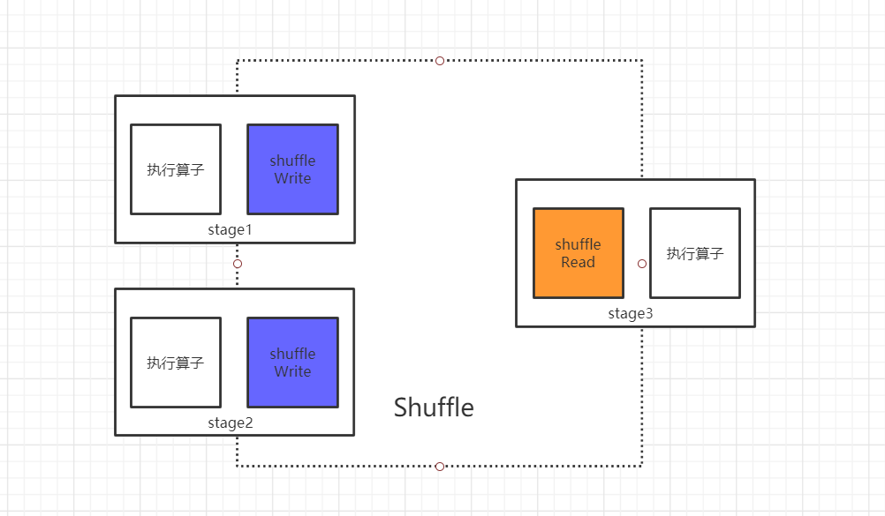
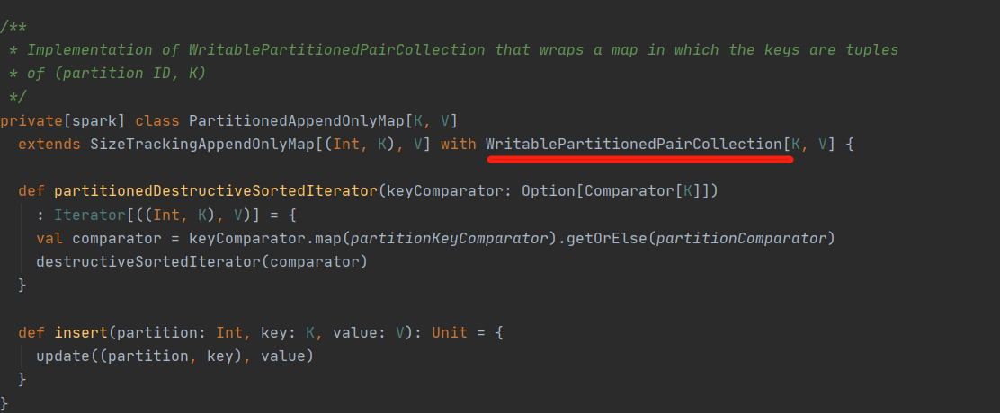

## 7 Shuffle

### 7.1 Shuffle简介

- 任何一个分布式的计算系统，shuffle都是最为致命的性能瓶颈，因为shuffle会产生数据的移动和网络拷贝，走网络拷贝就不是程序能决定的了，涉及到网络硬件的数据传输，所以任何时候，shuffle都会产生性能的问题
- spark的shuffle经过多年发展已经逐渐趋于成熟，主要有早期的HashShuffleManager以及现在默认使用的SortShuffleManager。


- 宽依赖的时候就可以明显看出分区间的数据形成的线条非常多，而且子RDD的一个分区中的数据依赖于多个父RDD分区，这时就产生shuffle

### 7.1 Spark的shuffle演进历史

- Spark 0.8及以前 Hash Based Shuffle
- Spark 0.8.1 为Hash Based Shuffle引入File Consolidation机制
- Spark 0.9 引入ExternalAppendOnlyMap
- Spark 1.1 引入Sort Based Shuffle，但默认仍为Hash Based Shuffle
- Spark 1.2 默认的Shuffle方式改为Sort Based Shuffle
- Spark 1.4 引入Tungsten-Sort Based Shuffle
- Spark 1.6 Tungsten-sort并入Sort Based Shuffle
- Spark 2.0 Hash Based Shuffle退出历史舞台

### 7.3 MapReduce Shuffle介绍

- Map端完成之后会提供一个HttpServer，让Reduce端可以通过其获取数据
- Reduce启动拷贝线程从各个Map中拷贝数据，产生大量网络I/O，边拷贝还要边进行merge操作，产生大量内存开销


> 1. Split：首先根据数据的split数量决定map任务数量（比如一个512MB的文件，以128MB切分，生成的就是4个map任务）
> 2. Map：map任务处理任务，将结果写到环形缓冲区（内存提高速度），当到达环形缓冲区的阈值，就会将数据写入到磁盘，（在写磁盘的过程中会将数据排序）
> 3. 为什么排序：因为一个map任务输出到磁盘的文件是多个，如果后期reduce从这么多文件中找到对应的key-value，开销太大，所以采用排序后在讲文件落盘，等map任务执行后，在将这些小文件，进行归并排序，合成一个相对的大文件。
> 4. 归并排序简单理解：假设有2个排序后的元数组[7,10]，[6,8]，那么先申请一个空间为4的数组，然后对比2个元，将值小的数放入新数组，循环。
> 5. Reduce：从若干个Map输出的结果中将需要的key，Copy到Reduce端，在进行一次sort排序，最后交由reduce处理。
> 6. <font color=red>Shuffle</font>：会将map端的相同的key-value发往同一个reduce

### 7.3 Spark Shuffle阶段



> 主要分为ShuffleMapTask阶段，和ResultTask阶段

- ShuffleMapTask，主要方法runTask如下

```ruby
  override def runTask(context: TaskContext): MapStatus = {
    // Deserialize the RDD using the broadcast variable.
    val threadMXBean = ManagementFactory.getThreadMXBean
    val deserializeStartTime = System.currentTimeMillis()
    val deserializeStartCpuTime = if (threadMXBean.isCurrentThreadCpuTimeSupported) {
      threadMXBean.getCurrentThreadCpuTime
    } else 0L
    //序列化器
    val ser = SparkEnv.get.closureSerializer.newInstance()
    //从taskBinary中反序列化：Broadcast[Array[Byte]]
    val (rdd, dep) = ser.deserialize[(RDD[_], ShuffleDependency[_, _, _])](
      ByteBuffer.wrap(taskBinary.value), Thread.currentThread.getContextClassLoader)
    _executorDeserializeTime = System.currentTimeMillis() - deserializeStartTime
    _executorDeserializeCpuTime = if (threadMXBean.isCurrentThreadCpuTimeSupported) {
      threadMXBean.getCurrentThreadCpuTime - deserializeStartCpuTime
    } else 0L

    var writer: ShuffleWriter[Any, Any] = null
    try {
      val manager = SparkEnv.get.shuffleManager
      //通过 dep：ShuffleDependency 拿到 writer: ShuffleWriter,dep.shuffleHandle就是使用哪种shuffleWrite来进行写操作
      writer = manager.getWriter[Any, Any](dep.shuffleHandle, partitionId, context)
      //落盘
      writer.write(rdd.iterator(partition, context).asInstanceOf[Iterator[_ <: Product2[Any, Any]]])
      //返回MapStatus等记录map任务情况的信息
      writer.stop(success = true).get
    } catch {
      case e: Exception =>
        try {
          if (writer != null) {
            writer.stop(success = false)
          }
        } catch {
          case e: Exception =>
            log.debug("Could not stop writer", e)
        }
        throw e
    }
  }
```

- 从ResultTask中主要方法runTask如下

```ruby
  override def runTask(context: TaskContext): U = {
    // Deserialize the RDD and the func using the broadcast variables.
    val threadMXBean = ManagementFactory.getThreadMXBean
    val deserializeStartTime = System.currentTimeMillis()
    val deserializeStartCpuTime = if (threadMXBean.isCurrentThreadCpuTimeSupported) {
      threadMXBean.getCurrentThreadCpuTime
    } else 0L
    //序列化器
    val ser = SparkEnv.get.closureSerializer.newInstance()
    //从taskBinary中反序列化：Broadcast[Array[Byte]]，注意这里得到的是func,func就是运行action算子时候需要的统计逻辑
    val (rdd, func) = ser.deserialize[(RDD[T], (TaskContext, Iterator[T]) => U)](
      ByteBuffer.wrap(taskBinary.value), Thread.currentThread.getContextClassLoader)
    _executorDeserializeTime = System.currentTimeMillis() - deserializeStartTime
    _executorDeserializeCpuTime = if (threadMXBean.isCurrentThreadCpuTimeSupported) {
      threadMXBean.getCurrentThreadCpuTime - deserializeStartCpuTime
    } else 0L

    func(context, rdd.iterator(partition, context))
  }
```

### 7.4 ShuffleManager

- 在sparkEnv中创建


### 7.5 HashShuffleManager

#### 7.5.1 未经优化的HashShuffleManager

- 在spark早期版本当中，1.2.0之前的版本都是使用的HashShuffleManager，而0.8及以前版本未经优化的HashShuffleManager会产生大量的小文件，具体实现过程如下图.


- 在 Map Task 过程按照 Hash 的方式重组 Partition 的数据，不进行排序。每个 Map Task 为每个 Reduce Task 生成一个文件，通常会产生大量的文件（即对应为 M*R 个中间文件，其中 M 表示 Map Task 个数，R 表示 Reduce Task 个数），伴随大量的随机磁盘 I/O 操作与大量的内存开销。

- HashShuffleManager缺陷：
  - mapTask非常容易造成OOM：如果产生大量的MapTask-Buffer很容易将缓冲区直接撑爆
  - reduceTask非常容易造成OOM：如果ReduceTask-Buffer大量获取小文件很容易将缓冲区直接撑爆
  - reduceTask去拉取mapTask输出数据，大量小文件容易造成网络波动，产生大量小IO，增加机器负荷，容易引起网络失败而导致拉取失败

#### 7.5.2 经过优化的HashShuffleManager

- 原始的HashShuffleManager会产生大量的小文件，造成网络以及磁盘的大量浪费，所以为了解决大量小文件的问题，后来引入一种改进的HashShuffleManager.
- 针对上面的小文件过多问题，引入了 File Consolidation 机制。

- 一个 Executor 上所有的 Map Task 生成的分区文件只有一份，即将所有的 Map Task 相同的分区文件合并，这样每个 Executor 上最多只生成 N 个分区文件。  


- 尽管经过优化之后的HashShuffleManager有一定程度的小文件数量的减少，但是还是会产生很多小文件的问题。

- 这样就减少了文件数，但是假如下游 Stage 的分区数 N 很大，还是会在每个 Executor 上生成 N 个文件，同样，如果一个 Executor 上有 K 个 Core，还是会开 K*N 个 Writer Handler，所以这里仍然容易导致OOM。

### 7.6 SortShuffleManager

> 为了更好地解决HashShuffleManager的问题，Spark 参考了 MapReduce 中 Shuffle 的处理方式，引入基于排序的 Shuffle 写操作机制。总体上看来 Sort Shuffle 解决了 Hash Shuffle 的所有弊端，但是因为需要其 Shuffle 过程需要对记录进行排序，所以在性能上有所损失。

- SortShuffleManager的运行机制主要分成三种，普通运行机制、bypass运行机制、Unsafe运行机制

#### 7.6.1 普通运行机制

- 在普通模式下，每个task当中处理的数据，会先写入一个内存数据结构当中，内存数据结构是Map或者Array，根据不同的shuffle算子，选用不同的数据结构。如果是reduceByKey这类聚合shuffle算子，那么就会选用Map数据结构，如果是join这种普通shuffle算子，那么就会选用Array数据结构。
- 每写入一条数据，判断内存阈值，达到阈值，溢写到磁盘，清空内存结构数据。

- 溢写之前，会根据key对内存数据结构进行排序(为归并排序提供前提条件)，排序之后分批次写入磁盘，每批次默认写入10000条，使用java的BufferedOutputStream来实现的，可以减少磁盘IO次数，提升性能。

- task多次溢写，形成多个小文件，小文件最终进行合并(归并排序)，就是merge过程，此时将之前所有的溢写文件全部读取出来，然后依次写入最终的磁盘文件当中形成一个大文件，为了解决大文件分配到各个下游task的数据标识问题，还会写入一份索引文件，索引文件标识了下游每个task当汇总所属数据的start offset以及end  offset.

- SortShuffleManager由于有一个磁盘文件merge的过程，因此大大减少了文件数量。比如一个stage有50个task，总共有10个Executor，每个Executor执行5个task，由于每个task最终只有一个磁盘文件，因此此时每个Executor上只有5个磁盘文件，所有Executor只有50个磁盘文件。


#### 7.6.2 byPass运行机制

- byPass机制的触发条件：
  - shuffle  map task的数量 小于spark.shuffle.sort.bypassMergeThreshold参数的值（默认200）
  - 不是聚合类的shuffle算子（例如reduceByKey或者groupBy等）

> 此时task会为每个下游task都创建一个临时磁盘文件，对数据按照key进行hash取值，然后将对应的数据写入到对应的磁盘文件。最终进行磁盘文件的合并，并创建索引文件确定最后大的磁盘文件里面的数据属于哪一个下游的reducetask。


该机制与普通的SortShuffleManager不同在于：

- 磁盘写入机制不同
- 不会对数据进行排序

#### 7.6.3 Unsafe机制

- 序列化器是否支持Relocation，如kyro序列化器
- 不是聚合类的shuffle算子（例如reduceByKey或者groupBy等）
- 分区数 > (1 << 24) - 1 + 1 则不行;  // 16777215+1

#### 7.6.4 流程解析

##### 7.6.4.1 初始化shuffleBlockResolver

```ruby
override val shuffleBlockResolver = new IndexShuffleBlockResolver(conf)
```

##### 7.6.4.2 选择注册shuffle管理器ShuffleHandle


```ruby
  /**
   * Obtains a [[ShuffleHandle]] to pass to tasks.
   * 注册shuffle管理器，通过RDD之间的依赖关系，来进行注册shuffle管理器，
   * 这里使用到的shuffle管理器主要有三个。分别是BypassMergeSortShuffleHandle，SerializedShuffleHandle和BaseShuffleHandle
   * 对应了ShuffleMapTask类中的write
   * 在ShuffleDependency类中进行调用
   */
  override def registerShuffle[K, V, C](
      shuffleId: Int,
      numMaps: Int,
      dependency: ShuffleDependency[K, V, C]): ShuffleHandle = {
    //shouldBypassMergeSort方法判断是否满足Bypass机制(BypassMergeSortShuffleWriter)--
    if (SortShuffleWriter.shouldBypassMergeSort(conf, dependency)) {
      // If there are fewer than spark.shuffle.sort.bypassMergeThreshold partitions and we don't
      // need map-side aggregation, then write numPartitions files directly and just concatenate
      // them at the end. This avoids doing serialization and deserialization twice to merge
      // together the spilled files, which would happen with the normal code path. The downside is
      // having multiple files open at a time and thus more memory allocated to buffers.
      new BypassMergeSortShuffleHandle[K, V](
        shuffleId, numMaps, dependency.asInstanceOf[ShuffleDependency[K, V, V]])
    } else if (SortShuffleManager.canUseSerializedShuffle(dependency)) {  //canUseSerializedShuffle方法判断是否满足SerializedShuffle（UnsafeShuffleWriter）
      // Otherwise, try to buffer map outputs in a serialized form, since this is more efficient:
      new SerializedShuffleHandle[K, V](
        shuffleId, numMaps, dependency.asInstanceOf[ShuffleDependency[K, V, V]])
    } else {
      // Otherwise, buffer map outputs in a deserialized form:
      //其他情况使用 BaseShuffle（SortShuffleWriter）
      new BaseShuffleHandle(shuffleId, numMaps, dependency)
    }
  }

```

- shouldBypassMergeSort方法选择BypassMergeSortShuffleHandle

```ruby
private[spark] object SortShuffleWriter {
  def shouldBypassMergeSort(conf: SparkConf, dep: ShuffleDependency[_, _, _]): Boolean = {
    // We cannot bypass sorting if we need to do map-side aggregation.
    //查看是否有map端聚合，如果有则不能使用，比如reduceBykey这种算子
    if (dep.mapSideCombine) {
      false
    } else {  //spark.shuffle.sort.bypassMergeThreshold <= 200
      val bypassMergeThreshold: Int = conf.getInt("spark.shuffle.sort.bypassMergeThreshold", 200)
      dep.partitioner.numPartitions <= bypassMergeThreshold
    }
  }
}
```

- canUseSerializedShuffle方法选择SerializedShuffleHandle

```ruby
  def canUseSerializedShuffle(dependency: ShuffleDependency[_, _, _]): Boolean = {
    val shufId = dependency.shuffleId //用于打印日志信息
    val numPartitions = dependency.partitioner.numPartitions  //分区器中有多少分区
    if (!dependency.serializer.supportsRelocationOfSerializedObjects) {   //条件一：序列化器是否支持Relocation，如kyro序列化器
      log.debug(s"Can't use serialized shuffle for shuffle $shufId because the serializer, " +
        s"${dependency.serializer.getClass.getName}, does not support object relocation")
      false
    } else if (dependency.mapSideCombine) {   //条件二：序列化器是能存在map聚合
      log.debug(s"Can't use serialized shuffle for shuffle $shufId because we need to do " +
        s"map-side aggregation")
      false
    } else if (numPartitions > MAX_SHUFFLE_OUTPUT_PARTITIONS_FOR_SERIALIZED_MODE) { //条件三：分区数 > (1 << 24) - 1 + 1 则不行;  // 16777215+1
      log.debug(s"Can't use serialized shuffle for shuffle $shufId because it has more than " +
        s"$MAX_SHUFFLE_OUTPUT_PARTITIONS_FOR_SERIALIZED_MODE partitions")
      false
    } else {
      log.debug(s"Can use serialized shuffle for shuffle $shufId")
      true
    }
  }
```

- 其他情况使用BaseShuffleHandle

##### 7.6.4.3 ShuffleMapTask通过getWriter选择调用Write来溢写数据

```ruby
  override def getWriter[K, V](
      handle: ShuffleHandle,
      mapId: Int,
      context: TaskContext): ShuffleWriter[K, V] = {
    numMapsForShuffle.putIfAbsent(
      handle.shuffleId, handle.asInstanceOf[BaseShuffleHandle[_, _, _]].numMaps)
    val env = SparkEnv.get
    handle match {
      case unsafeShuffleHandle: SerializedShuffleHandle[K @unchecked, V @unchecked] =>
        new UnsafeShuffleWriter(
          env.blockManager,
          shuffleBlockResolver.asInstanceOf[IndexShuffleBlockResolver],
          context.taskMemoryManager(),
          unsafeShuffleHandle,
          mapId,
          context,
          env.conf)
      case bypassMergeSortHandle: BypassMergeSortShuffleHandle[K @unchecked, V @unchecked] =>
        new BypassMergeSortShuffleWriter(
          env.blockManager,
          shuffleBlockResolver.asInstanceOf[IndexShuffleBlockResolver],
          bypassMergeSortHandle,
          mapId,
          context,
          env.conf)
      case other: BaseShuffleHandle[K @unchecked, V @unchecked, _] =>
        new SortShuffleWriter(shuffleBlockResolver, other, mapId, context)
    }
  }
```

##### 7.6.4.4 ShuffledRDD调用compute方法来调用getReader方法来进行数据读取

```ruby
  override def getReader[K, C](
      handle: ShuffleHandle,
      startPartition: Int,
      endPartition: Int,
      context: TaskContext): ShuffleReader[K, C] = {
    new BlockStoreShuffleReader(
      handle.asInstanceOf[BaseShuffleHandle[K, _, C]], startPartition, endPartition, context)
  }
```

##### 7.6.4.5  shuffleBlockResolver调用stop方法回收shuffle管理器资源

```ruby
  override def stop(): Unit = {
    shuffleBlockResolver.stop()
  }
```

#### 7.6.5  BypassMergeSortShuffleWriter写解析

```ruby
  @Override
  public void write(Iterator<Product2<K, V>> records) throws IOException {
    assert (partitionWriters == null);//判断当前分区是否存在DiskBlockObjectWriter
    if (!records.hasNext()) { //是否有内容需要写,如果没有则进入
      partitionLengths = new long[numPartitions]; //记录分区长度
      shuffleBlockResolver.writeIndexFileAndCommit(shuffleId, mapId, partitionLengths, null); //构建index索引文件
      mapStatus = MapStatus$.MODULE$.apply(blockManager.shuffleServerId(), partitionLengths); //map状态
      return;
    }
    //如果有需要写的文件
    final SerializerInstance serInstance = serializer.newInstance();  //构造SerializerInstance
    final long openStartTime = System.nanoTime(); //开始时间
    partitionWriters = new DiskBlockObjectWriter[numPartitions];//根据分区数量生成DiskBlockObjectWriter数组
    partitionWriterSegments = new FileSegment[numPartitions]; //根据分区数量生成FileSegment数组
    for (int i = 0; i < numPartitions; i++) { //迭代每一个分区
      final Tuple2<TempShuffleBlockId, File> tempShuffleBlockIdPlusFile =
        blockManager.diskBlockManager().createTempShuffleBlock(); //通过DiskBlockManager生成临时TempShuffleBlockId对应文件
      final File file = tempShuffleBlockIdPlusFile._2();  //拿到文件
      final BlockId blockId = tempShuffleBlockIdPlusFile._1();  //拿到ID
      //通过blockManager生成DiskBlockObjectWriter，放到对应的DiskBlockObjectWriter数组中
      partitionWriters[i] =
        blockManager.getDiskWriter(blockId, file, serInstance, fileBufferSize, writeMetrics);
    }
    // Creating the file to write to and creating a disk writer both involve interacting with
    // the disk, and can take a long time in aggregate when we open many files, so should be
    // included in the shuffle write time.
    writeMetrics.incWriteTime(System.nanoTime() - openStartTime);

    while (records.hasNext()) { //如果有数据需要写
      final Product2<K, V> record = records.next(); //获取数据
      final K key = record._1();  //获取key
      //通过key确定分区，再确定DiskBlockObjectWriter，然后调用write写数据（临时文件）
      partitionWriters[partitioner.getPartition(key)].write(key, record._2());
    }

    for (int i = 0; i < numPartitions; i++) {
      final DiskBlockObjectWriter writer = partitionWriters[i];
      //写完文件后记录 FileSegment(val file: File, val offset: Long, val length: Long)
      partitionWriterSegments[i] = writer.commitAndGet();
      writer.close(); //回收资源
    }

    File output = shuffleBlockResolver.getDataFile(shuffleId, mapId); //获取真正写出的文件
    File tmp = Utils.tempFileWith(output);//文件名+UUID
    try {
      partitionLengths = writePartitionedFile(tmp); //然后将前面所有的文件全部写入到这个文件中（合并）
      shuffleBlockResolver.writeIndexFileAndCommit(shuffleId, mapId, partitionLengths, tmp);  //提交
    } finally {
      if (tmp.exists() && !tmp.delete()) {
        logger.error("Error while deleting temp file {}", tmp.getAbsolutePath());
      }
    }
    mapStatus = MapStatus$.MODULE$.apply(blockManager.shuffleServerId(), partitionLengths);//返回map状态类
  }
```

#### 7.6.6 UnsafeShuffleWriter写解析

##### 7.6.6.1 ShuffleExternalSorter

- 在看写操作之前，先要了解其主要依赖的实现类ShuffleExternalSorter，其是内存排序


##### 7.6.6.2 ShuffleExternalSorter中的元信息管理SpillInfo


##### 7.6.6.3 ShuffleExternalSorter中分区排序器ShuffleInMemorySorter

###### ShuffleInMemorySorter 内存结构


- ShuffleInMemorySorter中包含用于在内存中存储的数组LongArray


- LongArray中MemoryBlock用于管理内存，其继承自MemoryLocation


> 什么时候分配MemoryBlock？堆内内存：HeapMempryAllocator，堆外内存：UnsafeMemoryAllocator

- HeapMempryAllocator解析

```ruby
/**
 * A simple {@link MemoryAllocator} that can allocate up to 16GB using a JVM long primitive array.
 * 一个简单的{内存 分配者}，可以使用JAVA原语数组分配多达16GB的空间
 */
public class HeapMemoryAllocator implements MemoryAllocator {

  //弱引用内存空间，GC时则回收，在使用时可以先从选择废弃的空间重复利用
  @GuardedBy("this")
  private final Map<Long, LinkedList<WeakReference<long[]>>> bufferPoolsBySize = new HashMap<>();

  private static final int POOLING_THRESHOLD_BYTES = 1024 * 1024;

  /**
   * Returns true if allocations of the given size should go through the pooling mechanism and
   * false otherwise.
   */
  private boolean shouldPool(long size) {
    // Very small allocations are less likely to benefit from pooling.
    return size >= POOLING_THRESHOLD_BYTES;
  }

  @Override
  public MemoryBlock allocate(long size) throws OutOfMemoryError {
    int numWords = (int) ((size + 7) / 8);  //内存对齐
    long alignedSize = numWords * 8L;
    assert (alignedSize >= size);
    if (shouldPool(alignedSize)) {
      synchronized (this) {
        //从bufferPoolsBySize中拿出对应位置的LinkedList<WeakReference<long[]>>
        final LinkedList<WeakReference<long[]>> pool = bufferPoolsBySize.get(alignedSize);
        if (pool != null) {
          while (!pool.isEmpty()) { //如果不为空，则证明GC还没有回收掉这块空间
            final WeakReference<long[]> arrayReference = pool.pop();  //获得引用
            final long[] array = arrayReference.get();    //获得对应空间
            if (array != null) {
              assert (array.length * 8L >= size);
              MemoryBlock memory = new MemoryBlock(array, Platform.LONG_ARRAY_OFFSET, size);  //创建MemoryBlock
              if (MemoryAllocator.MEMORY_DEBUG_FILL_ENABLED) {
                memory.fill(MemoryAllocator.MEMORY_DEBUG_FILL_CLEAN_VALUE); //填充
              }
              return memory;
            }
          }
          bufferPoolsBySize.remove(alignedSize);  //释放资源
        }
      }
    }
    //如果在bufferPoolsBySize中没申请到空间，则直接创建
    long[] array = new long[numWords];
    MemoryBlock memory = new MemoryBlock(array, Platform.LONG_ARRAY_OFFSET, size);
    if (MemoryAllocator.MEMORY_DEBUG_FILL_ENABLED) {
      memory.fill(MemoryAllocator.MEMORY_DEBUG_FILL_CLEAN_VALUE); //填充
    }
    return memory;
  }

  //回收
  @Override
  public void free(MemoryBlock memory) {
    assert (memory.obj != null) : //如果obj为空，则是堆外内存，违背
      "baseObject was null; are you trying to use the on-heap allocator to free off-heap memory?";
    assert (memory.pageNumber != MemoryBlock.FREED_IN_ALLOCATOR_PAGE_NUMBER) :  //资源已经被释放
      "page has already been freed";
    assert ((memory.pageNumber == MemoryBlock.NO_PAGE_NUMBER)//必须首先通过TMM.freePage（）释放TMM分配的页面，而不是直接在分配器中释放
            || (memory.pageNumber == MemoryBlock.FREED_IN_TMM_PAGE_NUMBER)) :
      "TMM-allocated pages must first be freed via TMM.freePage(), not directly in allocator " +
        "free()";

    final long size = memory.size();  //拿到内存空间
    if (MemoryAllocator.MEMORY_DEBUG_FILL_ENABLED) {
      memory.fill(MemoryAllocator.MEMORY_DEBUG_FILL_FREED_VALUE);
    }

    // Mark the page as freed (so we can detect double-frees).
    memory.pageNumber = MemoryBlock.FREED_IN_ALLOCATOR_PAGE_NUMBER;

    // As an additional layer of defense against use-after-free bugs, we mutate the
    // MemoryBlock to null out its reference to the long[] array.
    //  MemoryBlock使对long []数组的引用无效
    long[] array = (long[]) memory.obj;
    memory.setObjAndOffset(null, 0);

    long alignedSize = ((size + 7) / 8) * 8;//内存对齐
    if (shouldPool(alignedSize)) {  //查看空间是否可以被重复使用
      synchronized (this) {
        LinkedList<WeakReference<long[]>> pool = bufferPoolsBySize.get(alignedSize);//拿到对应pool空间
        if (pool == null) {//如果pool为空，则创建LinkedList，添加进LinkedList<WeakReference<long[]>>
          pool = new LinkedList<>();
          bufferPoolsBySize.put(alignedSize, pool);
        }
        pool.add(new WeakReference<>(array));
      }
    } else {
      // Do nothing
    }
  }
}
```

- UnsafeMemoryAllocator解析

```ruby
/**
 * A simple {@link MemoryAllocator} that uses {@code Unsafe} to allocate off-heap memory.
 * 逃逸GC管理，分配堆外内存
 */
public class UnsafeMemoryAllocator implements MemoryAllocator {

  @Override
  public MemoryBlock allocate(long size) throws OutOfMemoryError {
    long address = Platform.allocateMemory(size); //直接调用_UNSAFE.allocateMemory(size);使用堆外内存
    MemoryBlock memory = new MemoryBlock(null, address, size);//传入null，创建堆外内存空间MemoryBlock
    if (MemoryAllocator.MEMORY_DEBUG_FILL_ENABLED) {
      memory.fill(MemoryAllocator.MEMORY_DEBUG_FILL_CLEAN_VALUE);
    }
    return memory;
  }

  @Override
  public void free(MemoryBlock memory) {
    assert (memory.obj == null) ://如果obj不为空，则是堆内内存，违背
      "baseObject not null; are you trying to use the off-heap allocator to free on-heap memory?";
    assert (memory.pageNumber != MemoryBlock.FREED_IN_ALLOCATOR_PAGE_NUMBER) ://资源已经被释放
      "page has already been freed";
    assert ((memory.pageNumber == MemoryBlock.NO_PAGE_NUMBER)//必须首先通过TMM.freePage（）释放TMM分配的页面，而不是直接在分配器中释放
            || (memory.pageNumber == MemoryBlock.FREED_IN_TMM_PAGE_NUMBER)) :
      "TMM-allocated pages must be freed via TMM.freePage(), not directly in allocator free()";

    if (MemoryAllocator.MEMORY_DEBUG_FILL_ENABLED) {
      memory.fill(MemoryAllocator.MEMORY_DEBUG_FILL_FREED_VALUE);
    }
    Platform.freeMemory(memory.offset); //直接调用_UNSAFE.freeMemory(address);释放内存空间
    // As an additional layer of defense against use-after-free bugs, we mutate the
    // MemoryBlock to reset its pointer.
    memory.offset = 0;
    // Mark the page as freed (so we can detect double-frees).
    memory.pageNumber = MemoryBlock.FREED_IN_ALLOCATOR_PAGE_NUMBER;
  }
}
```

###### ShuffleInMemorySorter任务内存管理TaskMemoryManager

- TaskMemoryManager的allocatePage方法，用于确定分配堆内或堆外内存

```ruby
public MemoryBlock allocatePage(long size, MemoryConsumer consumer) {
  assert(consumer != null);
  assert(consumer.getMode() == tungstenMemoryMode);
  if (size > MAXIMUM_PAGE_SIZE_BYTES) { //申请空间过大
    throw new TooLargePageException(size);
  }

  long acquired = acquireExecutionMemory(size, consumer); //申请内存
  if (acquired <= 0) {
    return null;
  }

  final int pageNumber;
  synchronized (this) {
    pageNumber = allocatedPages.nextClearBit(0);//分配空间对应ID
    if (pageNumber >= PAGE_TABLE_SIZE) {  //超出了TaskMemoryManager管理范围8192
      releaseExecutionMemory(acquired, consumer);
      throw new IllegalStateException(
        "Have already allocated a maximum of " + PAGE_TABLE_SIZE + " pages");
    }
    allocatedPages.set(pageNumber);//告知对应位置内存已经分配，修改标识位
  }
  MemoryBlock page = null;
  try {
    page = memoryManager.tungstenMemoryAllocator().allocate(acquired);  //**根据堆内堆外内存分配资源--
  } catch (OutOfMemoryError e) {
    logger.warn("Failed to allocate a page ({} bytes), try again.", acquired);
    // there is no enough memory actually, it means the actual free memory is smaller than
    // MemoryManager thought, we should keep the acquired memory.
    synchronized (this) {
      acquiredButNotUsed += acquired;
      allocatedPages.clear(pageNumber);
    }
    // this could trigger spilling to free some pages.
    return allocatePage(size, consumer);
  }
  page.pageNumber = pageNumber;
  pageTable[pageNumber] = page; //pageTable对应位置放入MemoryBlock(page)
  if (logger.isTraceEnabled()) {
    logger.trace("Allocate page number {} ({} bytes)", pageNumber, acquired);
  }
  return page;
}
```

###### ShuffleInMemorySorter中指针地址压缩器PackedRecordPointer

- Tungsten计划主要点

> 使用sum.misc.Unsafe直接管理内存，消除GC(堆外内存)
>
> 缓存感知计算：充分利用CPU内存提高缓存命中率(主要体现在排序)。速度：L1>L2>L3>内存>硬盘


- PackedRecordPointer结构


###### ShuffleInMemorySorter 排序器ShuffleSorterIterator

> 通过ShuffleInMemorySorter的getSortedIterator方法获取ShuffleSorterIterator来实现排序

```ruby
ry  /**
   * Return an iterator over record pointers in sorted order.
   */
  public ShuffleSorterIterator getSortedIterator() {
    int offset = 0;
    if (useRadixSort) { //如果为true，则为基数排序
      offset = RadixSort.sort(
        array, pos,
        PackedRecordPointer.PARTITION_ID_START_BYTE_INDEX,
        PackedRecordPointer.PARTITION_ID_END_BYTE_INDEX, false, false);
    } else {  //插入和归并结合的排序TimSort
      MemoryBlock unused = new MemoryBlock(
        array.getBaseObject(),
        array.getBaseOffset() + pos * 8L,
        (array.size() - pos) * 8L);
      LongArray buffer = new LongArray(unused);
      Sorter<PackedRecordPointer, LongArray> sorter =
        new Sorter<>(new ShuffleSortDataFormat(buffer));

      sorter.sort(array, 0, pos, SORT_COMPARATOR);
    }
    return new ShuffleSorterIterator(pos, array, offset);
  }
}
```

> 基础排序举例：
>
> 元数据：33,18,26,44,17
>
> 定义一个10个桶：0,1,2,3,4,5,6,7,8,9
>
> 第一轮排序根据个位数选择桶:  
>
> 0.  无
> 1. 无
> 2. 无
> 3. 33
> 4. 44
> 5. 无
> 6. 26
> 7. 17
> 8. 18
> 9. 无
>
> 第二轮排序在第一轮的基础上根据十位数选择桶:  
>
> 0. 无
> 1. 17,18(因为7号桶比8号桶小先拿到)
> 2. 26
> 3. 33
> 4. 44
> 5. 无
> 6. 无
> 7. 无
> 8. 无
> 9. 无
>
> 得到最终结果：17,18,26,33,44

> Timsort就不做介绍了，自行百度


#### 7.6.7 SortShuffleWriter 写解析


```ruby
/** Write a bunch of records to this task's output */
override def write(records: Iterator[Product2[K, V]]): Unit = { //传入kv类型的数据迭代器
  //注意ExternalSorter入参
  sorter = if (dep.mapSideCombine) {  //存在map端聚合
    new ExternalSorter[K, V, C](
      context, dep.aggregator, Some(dep.partitioner), dep.keyOrdering, dep.serializer)
  } else {  //不存在map端聚合
    // In this case we pass neither an aggregator nor an ordering to the sorter, because we don't
    // care whether the keys get sorted in each partition; that will be done on the reduce side
    // if the operation being run is sortByKey.
    new ExternalSorter[K, V, V](
      context, aggregator = None, Some(dep.partitioner), ordering = None, dep.serializer)
  }
  sorter.insertAll(records) //记录插入sorter

  // Don't bother including the time to open the merged output file in the shuffle write time,
  // because it just opens a single file, so is typically too fast to measure accurately
  // (see SPARK-3570).
  //构建输出文件
  val output = shuffleBlockResolver.getDataFile(dep.shuffleId, mapId)
  val tmp = Utils.tempFileWith(output)
  try {
    val blockId = ShuffleBlockId(dep.shuffleId, mapId, IndexShuffleBlockResolver.NOOP_REDUCE_ID)
    val partitionLengths = sorter.writePartitionedFile(blockId, tmp)  //sorter写出每个分区的文件
    shuffleBlockResolver.writeIndexFileAndCommit(dep.shuffleId, mapId, partitionLengths, tmp) //构建索引文件
    mapStatus = MapStatus(blockManager.shuffleServerId, partitionLengths) //map状态信息
  } finally {
    if (tmp.exists() && !tmp.delete()) {
      logError(s"Error while deleting temp file ${tmp.getAbsolutePath}")
    }
  }
}
```

- ExternalSorter结构


- PartitionedAppendOnlyMap结构



- PartitionedPairBuffer结构


- WritablePartitionedPairCollection

```ruby
/**
 * A common interface for size-tracking collections of key-value pairs that
 *
 *  - Have an associated partition for each key-value pair.
 *  - Support a memory-efficient sorted iterator
 *  - Support a WritablePartitionedIterator for writing the contents directly as bytes.
 */
private[spark] trait WritablePartitionedPairCollection[K, V] {
  /**
   * Insert a key-value pair with a partition into the collection
   * 插入partition和key，value信息
   */
  def insert(partition: Int, key: K, value: V): Unit

  /**
   * Iterate through the data in order of partition ID and then the given comparator. This may
   * destroy the underlying collection.
   * 根据给定key的比较器，返回分区迭代器
   */
  def partitionedDestructiveSortedIterator(keyComparator: Option[Comparator[K]])
    : Iterator[((Int, K), V)]

  /**
   * Iterate through the data and write out the elements instead of returning them. Records are
   * returned in order of their partition ID and then the given comparator.
   * This may destroy the underlying collection.
   * 根据给定key的比较器，返回可写的分区迭代器
   */
  def destructiveSortedWritablePartitionedIterator(keyComparator: Option[Comparator[K]])
    : WritablePartitionedIterator = {
    val it = partitionedDestructiveSortedIterator(keyComparator)
    new WritablePartitionedIterator {
      private[this] var cur = if (it.hasNext) it.next() else null

      def writeNext(writer: DiskBlockObjectWriter): Unit = {
        writer.write(cur._1._2, cur._2)
        cur = if (it.hasNext) it.next() else null
      }

      def hasNext(): Boolean = cur != null

      def nextPartition(): Int = cur._1._1
    }
  }
}
//伴生对象
private[spark] object WritablePartitionedPairCollection {
  /**
   * A comparator for (Int, K) pairs that orders them by only their partition ID.
   * 根据partitionID进行比较，直接拿到2个分区ID相减
   */
  def partitionComparator[K]: Comparator[(Int, K)] = new Comparator[(Int, K)] {
    override def compare(a: (Int, K), b: (Int, K)): Int = {
      a._1 - b._1
    }
  }

  /**
   * A comparator for (Int, K) pairs that orders them both by their partition ID and a key ordering.
   * 根据KEY比较
   */
  def partitionKeyComparator[K](keyComparator: Comparator[K]): Comparator[(Int, K)] = {
    new Comparator[(Int, K)] {
      override def compare(a: (Int, K), b: (Int, K)): Int = {
        val partitionDiff = a._1 - b._1
        if (partitionDiff != 0) {//看是否是同一个分区
          partitionDiff
        } else {
          keyComparator.compare(a._2, b._2) //根据key比较
        }
      }
    }
  }
}

/**
 * Iterator that writes elements to a DiskBlockObjectWriter instead of returning them. Each element
 * has an associated partition.
 */
private[spark] trait WritablePartitionedIterator {
  def writeNext(writer: DiskBlockObjectWriter): Unit

  def hasNext(): Boolean

  def nextPartition(): Int
}
```

- PartitionedPairBuffer解析

> 数据结构

```ruby
/**
   * 使用一个2倍数据长度的数组来保存partition,key,value
   * 格式如：[(partition,k),(v),(partition,k),(v),(partition,k),(v)....]
   */
  private var data = new Array[AnyRef](2 * initialCapacity)
```

> 扩容操作

```ruby
/** Add an element into the buffer */
def insert(partition: Int, key: K, value: V): Unit = {
  if (curSize == capacity) {  //看一下游标是不是等于容量，如果是证明存满了
    growArray() //扩容--
  }
  //放数据[(partition,k),(v),(partition,k),(v),(partition,k),(v)....]
  data(2 * curSize) = (partition, key.asInstanceOf[AnyRef])
  data(2 * curSize + 1) = value.asInstanceOf[AnyRef]
  curSize += 1
  afterUpdate()
}

/** Double the size of the array because we've reached capacity */
private def growArray(): Unit = {
  if (capacity >= MAXIMUM_CAPACITY) {//不能超过最大容量
    throw new IllegalStateException(s"Can't insert more than ${MAXIMUM_CAPACITY} elements")
  }
  val newCapacity =
    if (capacity * 2 > MAXIMUM_CAPACITY) { // Overflow溢出
      MAXIMUM_CAPACITY
    } else {
      capacity * 2
    }
  val newArray = new Array[AnyRef](2 * newCapacity) //构建一个新数组
  //扩容操作
  System.arraycopy(data, 0, newArray, 0, 2 * capacity)
  data = newArray
  capacity = newCapacity
  resetSamples()
}
```

>排序

```ruby
/** Iterate through the data in a given order. For this class this is not really destructive.
 * 根据key进行排序
 * */
override def partitionedDestructiveSortedIterator(keyComparator: Option[Comparator[K]])
  : Iterator[((Int, K), V)] = {
  //调用WritablePartitionedPairCollection的partitionKeyComparator获取比较器
  val comparator = keyComparator.map(partitionKeyComparator).getOrElse(partitionComparator)
  //使用Timsort进行排序--
  new Sorter(new KVArraySortDataFormat[(Int, K), AnyRef]).sort(data, 0, curSize, comparator)
  iterator  //返回排序后的迭代器
}
```

- PartitionedAppendOnlyMap解析


> AppendOnlyMap结构

```ruby
  private val LOAD_FACTOR = 0.7 //扩容因子
  private var capacity = nextPowerOf2(initialCapacity)  //容量需要为2的N次方
  private var mask = capacity - 1 //盐值
  private var curSize = 0 //游标
  private var growThreshold = (LOAD_FACTOR * capacity).toInt  //扩容阀值 LOAD_FACTOR扩容因子 * capacity容量
// Holds keys and values in the same array for memory locality; specifically, the order of
// elements is key0, value0, key1, value1, key2, value2, etc.
//同样使用2倍长度的数组存放数据
private var data = new Array[AnyRef](2 * capacity)
```

> AppendOnlyMap设置键的值

```ruby
/** Set the value for a key
 * 设置键的值
 * */
def update(key: K, value: V): Unit = {
  assert(!destroyed, destructionMessage)
  val k = key.asInstanceOf[AnyRef]
  if (k.eq(null)) { //判断key值是否为null
    if (!haveNullValue) {
      incrementSize() //如果value不为null那么size加1
    }
    //如果value为null处理
    nullValue = value
    haveNullValue = true
    return
  }
  //如果key不为null
  var pos = rehash(key.hashCode) & mask //根据盐值计算hash，保证不会大于数组大小，与运算加快速度，保证条件就是数组长度为2的N次方
  var i = 1
  while (true) {
    val curKey = data(2 * pos)  //拿到当前的实际key位置
    if (curKey.eq(null)) {  //如果当前位置为空，证明没有hash冲突
      //直接设置当前位置的k,v
      data(2 * pos) = k
      data(2 * pos + 1) = value.asInstanceOf[AnyRef]
      incrementSize()  // Since we added a new key  位置自增
      return
    } else if (k.eq(curKey) || k.equals(curKey)) {  //如果当前位置不为空，判断key是不是同一个
      //如果key是相同的，重新替换value
      data(2 * pos + 1) = value.asInstanceOf[AnyRef]
      return
    } else {  //如果key不是同一个，说明该位置被占，那么pos+1 * 盐，重新计算位置
      val delta = i
      pos = (pos + delta) & mask
      i += 1
    }
  }
}
```

> AppendOnlyMap取出键的值

```ruby
/** Get the value for a given key
 * 获取给定键的值
 * */
def apply(key: K): V = {
  assert(!destroyed, destructionMessage)
  val k = key.asInstanceOf[AnyRef]
  if (k.eq(null)) { //如果key为null，直接返回nullValue
    return nullValue
  }
  //如果如果key不为null，计算其位置
  var pos = rehash(k.hashCode) & mask
  var i = 1
  while (true) {
    val curKey = data(2 * pos)  //获取当前key位置
    if (k.eq(curKey) || k.equals(curKey)) { //如果这个位置的key是的需要的key，则直接返回结果
      return data(2 * pos + 1).asInstanceOf[V]
    } else if (curKey.eq(null)) {//如果当前key位置为空，返回null
      return null.asInstanceOf[V]
    } else {  //如果没有上述情况，重新计算位置往后找
      val delta = i
      pos = (pos + delta) & mask
      i += 1
    }
  }
  null.asInstanceOf[V]
}
```

> AppendOnlyMap更新value值

```ruby
/**
 * Set the value for key to updateFunc(hadValue, oldValue), where oldValue will be the old value
 * for key, if any, or null otherwise. Returns the newly updated value.
 * 跟新value值，需要传入key和一个跟新函数updateFunc: (Boolean, V)
 */
def changeValue(key: K, updateFunc: (Boolean, V) => V): V = {
  assert(!destroyed, destructionMessage)
  val k = key.asInstanceOf[AnyRef]
  if (k.eq(null)) { //key为null情况处理
    if (!haveNullValue) {
      incrementSize()
    }
    //跟新nullValue
    nullValue = updateFunc(haveNullValue, nullValue)
    haveNullValue = true
    return nullValue
  }
  //key不为空，计算算位置
  var pos = rehash(k.hashCode) & mask
  var i = 1
  while (true) {
    val curKey = data(2 * pos)  //获取当前位置
    if (curKey.eq(null)) {  //当前位置为空逻辑
      val newValue = updateFunc(false, null.asInstanceOf[V])
      data(2 * pos) = k
      data(2 * pos + 1) = newValue.asInstanceOf[AnyRef]
      incrementSize()
      return newValue
    } else if (k.eq(curKey) || k.equals(curKey)) {  //当前位置被占用逻辑
      val newValue = updateFunc(true, data(2 * pos + 1).asInstanceOf[V])
      data(2 * pos + 1) = newValue.asInstanceOf[AnyRef]
      return newValue
    } else {  //重新计算位置，往后迭代
      val delta = i
      pos = (pos + delta) & mask
      i += 1
    }
  }
  null.asInstanceOf[V] // Never reached but needed to keep compiler happy
}
```

>在AppendOnlyMap中incrementSize调用growTable方法进行扩容

```ruby
protected def growTable() {
  // capacity < MAXIMUM_CAPACITY (2 ^ 29) so capacity * 2 won't overflow
  val newCapacity = capacity * 2  //新大小
  require(newCapacity <= MAXIMUM_CAPACITY, s"Can't contain more than ${growThreshold} elements")
  val newData = new Array[AnyRef](2 * newCapacity)  //新数组
  val newMask = newCapacity - 1 //新盐值
  // Insert all our old values into the new array. Note that because our old keys are
  // unique, there's no need to check for equality here when we insert.
  //以下做copy动作
  var oldPos = 0  //旧数组位置从0开始迭代
  while (oldPos < capacity) {
    if (!data(2 * oldPos).eq(null)) { //看当前位置是否存在值，如果存在那么移动
      //取出当前k,v，计算新的位置newPos
      val key = data(2 * oldPos)
      val value = data(2 * oldPos + 1)
      var newPos = rehash(key.hashCode) & newMask
      var i = 1
      var keepGoing = true
      while (keepGoing) {
        val curKey = newData(2 * newPos)
        //进行放入，遇到hash冲突往后找
        if (curKey.eq(null)) {
          newData(2 * newPos) = key
          newData(2 * newPos + 1) = value
          keepGoing = false
        } else {
          val delta = i
          newPos = (newPos + delta) & newMask
          i += 1
        }
      }
    }
    oldPos += 1
  }
  //复值
  data = newData
  capacity = newCapacity
  mask = newMask
  growThreshold = (LOAD_FACTOR * newCapacity).toInt //重新计算扩容阀值
}
```

> PartitionedAppendOnlyMap排序

```ruby
def partitionedDestructiveSortedIterator(keyComparator: Option[Comparator[K]])
  : Iterator[((Int, K), V)] = {
  //调用WritablePartitionedPairCollection的partitionKeyComparator获取比较器
  val comparator = keyComparator.map(partitionKeyComparator).getOrElse(partitionComparator)
  destructiveSortedIterator(comparator)
}
```

```ruby
def destructiveSortedIterator(keyComparator: Comparator[K]): Iterator[(K, V)] = {
  destroyed = true  //标识AppendOnlyMap不能在插入数据了，需要进行排序操作了
  // Pack KV pairs into the front of the underlying array
  var keyIndex, newIndex = 0  //keyIndex遍历的元素位置 newIndex要移动的目标位置
  while (keyIndex < capacity) { //keyIndex遍历的元素位置从0开始
    if (data(2 * keyIndex) != null) { //将当前的null元素删除，其他非null数据前移，从而给归并排序提供额外的空间
      data(2 * newIndex) = data(2 * keyIndex)
      data(2 * newIndex + 1) = data(2 * keyIndex + 1)
      newIndex += 1
    }
    keyIndex += 1
  }
  assert(curSize == newIndex + (if (haveNullValue) 1 else 0))
  //排序Timsort，该算法是归并和插入的结合，所以需要额外空间，由上面给出
  new Sorter(new KVArraySortDataFormat[K, AnyRef]).sort(data, 0, newIndex, keyComparator)
  //按顺序取出结果放入Iterator
  new Iterator[(K, V)] {
    var i = 0
    var nullValueReady = haveNullValue
    def hasNext: Boolean = (i < newIndex || nullValueReady)
    def next(): (K, V) = {
      if (nullValueReady) {
        nullValueReady = false
        (null.asInstanceOf[K], nullValue)
      } else {
        val item = (data(2 * i).asInstanceOf[K], data(2 * i + 1).asInstanceOf[V])
        i += 1
        item
      }
    }
  }
}
```

- ExternalSorter解析

```ruby
//插入数据
def insertAll(records: Iterator[Product2[K, V]]): Unit = {
  // TODO: stop combining if we find that the reduction factor isn't high
  val shouldCombine = aggregator.isDefined  //聚合是否被定义

  if (shouldCombine) {  //聚合被定义
    // Combine values in-memory first using our AppendOnlyMap
    val mergeValue = aggregator.get.mergeValue
    val createCombiner = aggregator.get.createCombiner
    var kv: Product2[K, V] = null
    val update = (hadValue: Boolean, oldValue: C) => {  //changeValue中需要传入的fuc，hadValue有没有值，oldValue旧值，返回新值
      //如果有值调用mergeValue，如果没值调用createCombiner
      if (hadValue) mergeValue(oldValue, kv._2) else createCombiner(kv._2)
    }
    while (records.hasNext) {
      addElementsRead()
      kv = records.next() //从记录中取出k,v
      //PartitionedAppendOnlyMap调用changeValue，更新值
      map.changeValue((getPartition(kv._1), kv._1), update)
      maybeSpillCollection(usingMap = true) //检测是否需要溢写磁盘
    }
  } else {//聚合未被定义
    // Stick values into our buffer
    while (records.hasNext) {
      addElementsRead()
      val kv = records.next()//从记录中取出k,v
      //PartitionedPairBuffer调用insert，插入值
      buffer.insert(getPartition(kv._1), kv._1, kv._2.asInstanceOf[C])
      maybeSpillCollection(usingMap = false)//检测是否需要溢写磁盘
    }
  }
}
```


